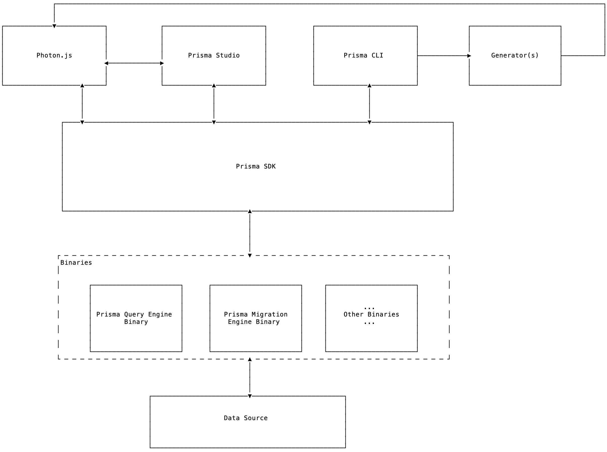

# Binaries

- Owner: @divyenduz
- Stakeholders: @mavilein @timsuchanek
- State:
  - Spec: Stable ✅
  - Implementation: In Progress 🚧

Binaries are the artifacts generated by compiling Prisma's core (written in Rust).

---

<!-- START doctoc generated TOC please keep comment here to allow auto update -->
<!-- DON'T EDIT THIS SECTION, INSTEAD RE-RUN doctoc TO UPDATE -->


- [Context](#context)
- [Binaries](#binaries)
  - [Prisma Query Engine Binary](#prisma-query-engine-binary)
  - [Prisma Migration Engine Binary](#prisma-migration-engine-binary)
  - [Utility Binaries](#utility-binaries)
    - [Prisma Format Binary](#prisma-format-binary)
- [Binary Files](#binary-files)
  - [Why?](#why)
  - [How?](#how)
  - [Binary builds](#binary-builds)
  - [Linux distributions and versions](#linux-distributions-and-versions)
  - [Cloud environments](#cloud-environments)
  - [Status legend](#status-legend)
  - [Footnotes](#footnotes)
    - [URL Scheme](#url-scheme)
  - [Naming Convention](#naming-convention)
  - [Custom Binary](#custom-binary)
  - [OpenSSL](#openssl)
- [Binary Protocols](#binary-protocols)
  - [Data Protocol](#data-protocol)
    - [Prisma Query Engine Binary](#prisma-query-engine-binary-1)
    - [Prisma Migration Engine Binary](#prisma-migration-engine-binary-1)
  - [Process Management](#process-management)
- [Use Case: Prisma CLI](#use-case-prisma-cli)
  - [How to Fetch Binaries](#how-to-fetch-binaries)
    - [Environment Variables](#environment-variables)
    - [Environment Variables Error Handling](#environment-variables-error-handling)
  - [Example Scenarios](#example-scenarios)
    - [1. Development machine is a Raspberry Pi and the deployment platform is AWS Lambda](#1-development-machine-is-a-raspberry-pi-and-the-deployment-platform-is-aws-lambda)
    - [2. We are using CLI in a build system from a provider for which we do not have a working pre-compiled binary](#2-we-are-using-cli-in-a-build-system-from-a-provider-for-which-we-do-not-have-a-working-pre-compiled-binary)
- [Use Case: Photon.js Generator](#use-case-photonjs-generator)
  - [How to Fetch Binaries](#how-to-fetch-binaries-1)
    - [Configuration](#configuration)
    - [Configuration Error Handling](#configuration-error-handling)
  - [Runtime](#runtime)
  - [Example Scenarios](#example-scenarios-1)
    - [1. Development machine is Mac but the deployment platform is AWS lambda.](#1-development-machine-is-mac-but-the-deployment-platform-is-aws-lambda)
    - [2. Deterministically choose the binary-based a runtime environment variable](#2-deterministically-choose-the-binary-based-a-runtime-environment-variable)
    - [3. Development machine is Mac but we need a custom binary in production](#3-development-machine-is-mac-but-we-need-a-custom-binary-in-production)
    - [4. Development machine is a Raspberry Pi and the deployment platform is AWS Lambda](#4-development-machine-is-a-raspberry-pi-and-the-deployment-platform-is-aws-lambda)

<!-- END doctoc generated TOC please keep comment here to allow auto update -->

## Context

Binaries are at the core of Photon, Lift and Prisma CLI via the Prisma SDK.



<!-- TODO: Use Figma for image once the proxy tool is ready https://figma-image-proxy.prisma.now.sh/?id=15:1&file=syRJTHIabeqK69mKHBwSlP -->

They are, however, compiled for a specific platform, that leads to the following requirements:

- Minimal configuration, simple mental model.
- Possibility of a deterministic binary resolution both locally and production setup.
- Easy setup of development and deployment workflows.

The binaries are used in multiple use cases, some of which are noted below:

- [Prisma CLI example scenarios](#example-scenarios)
- [Generators (Photon, Nexus etc) example scenarios](#example-scenarios)

## Binaries

Binaries are the artifacts generated by compiling the Prisma's core (written in Rust). The following binaries are generated:

### Prisma Query Engine Binary

Prisma query engine binary has the following use cases:

A generator like [`Photon`](https://photonjs.prisma.io)

- Uses this binary to run queries against a data source (at runtime of generated code).
- Binary is downloaded when Photon is generated.

Prisma CLI

- Generation uses this binary to fetch internal schema representation (at the time of running `generate` CLI command).
- Binary is downloaded when the CLI is installed.

### Prisma Migration Engine Binary

Prisma migration engine binary has the following use cases:

A generator like `prisma-test-utils`

- Uses this binary to perform migrations (at runtime of generated code)
- Binary is downloaded when `prisma-test-utils` is generated.

Prisma CLI

- Lift commands use the binary to perform migrations or calculate pending migrations (at the time of running various `lift` commands like `up`, `save` etc).
- Binary is downloaded when the CLI is installed.

### Utility Binaries

#### Prisma Format Binary

VSCode Prisma extension uses this binary for providing code formatting features.

## Binary Files

Prisma provides multiple binaries for various platforms and operating systems.

### Why?

We need different binaries because operating systems such as Windows and Linux work 
fundamentally different. Some Linux distributions have the same issue. On top of that,
different versions of Linux distributions have different versions of OpenSSL installed,
which is why we need different binaries for those as well.

### How?

We build multiple binaries on common operating systems with different combinations
of OpenSSL versions. This results in a few binaries which work on a large selection
of operating systems, distributions and cloud platforms.

Initially, we built specific binaries for given platforms (e.g. Netlify), which resulted in many 
binaries which couldn't be shared with similar platforms and it was hard to maintain. 

### Binary builds

The following table lists the pre-built binaries provided by Prisma.
These include Windows and Mac, and multiple variations for Linux distributions

| Build          | OS                  | OpenSSL variations | Downloads |
| :------------- | :------------------ | :----------------: | :-------- |
| `darwin`       | Mac                 | n/a                | (tbd)     |
| `windows`      | Windows             | n/a                | (tbd)     |
| `debian`       | Debian              | 1.0.x, 1.1.y       | (tbd)     |
| `rhel`         | CentOS              | 1.0.x, 1.1.y       | (tbd)     |

### Linux distributions and versions

This table shows which Linux distributions are compatible with our pre-built binaries.

| OS                  | Version                  | Build          | Status [?](#status-legend) | OpenSSL [[1]](#openssl) | Comment |
| :------------------ | :----------------------- | :------------- | :------------------------: | :---------------------: | :------ |
| Debian              | 8 (Jessie)               | `debian`       | (:heavy_check_mark:)       | 1.0.x                   | [[2]](#dependencies) install `nodejs` or `libssl1.0.0`
|                     | 9 (Stretch)              |                | (:heavy_check_mark:)       | 1.1.x                   | [[2]](#dependencies) install `nodejs` or `libssl1.1`
|                     | 10 (Buster)              |                | (:heavy_check_mark:)       | 1.1.x                   | [[2]](#dependencies) install `nodejs` or `libssl1.1`
| Ubuntu              | 14.04 (trusty)           | `debian`       | (:heavy_check_mark:)       | 1.0.x                   | [[2]](#dependencies) install `nodejs` or `openssl`
|                     | 16.04 (xenial)           |                | (:heavy_check_mark:)       | 1.0.x                   | [[2]](#dependencies) install `nodejs` or `openssl`
|                     | 18.04 (bionic)           |                | (:heavy_check_mark:)       | 1.1.x                   | [[2]](#dependencies) install `nodejs` or `openssl`
|                     | 19.04 (disco)            |                | (:heavy_check_mark:)       | 1.1.x                   | [[2]](#dependencies) install `nodejs` or `openssl`
| CentOS              | 6                        | `rhel`         | :heavy_check_mark:         | 1.0.x                   |
|                     | 7                        |                | :heavy_check_mark:         | 1.0.x                   |
| Fedora              | 28                       | `rhel`         | :heavy_check_mark:         | 1.1.x                   |
|                     | 29                       |                | :heavy_check_mark:         | 1.1.x                   |
|                     | 30                       |                | :heavy_check_mark:         | 1.1.x                   |
| Linux Mint          | 18                       | `debian`       | (:heavy_check_mark:)       | 1.0.x                   | [[2]](#dependencies) install `nodejs` or `openssl`
|                     | 19                       |                | (:heavy_check_mark:)       | 1.1.x                   | [[2]](#dependencies) install `nodejs` or `openssl`
| Arch Linux          | 2019.09.01               | `debian`       | :heavy_check_mark:         | 1.1.x                   |
| Alpine              | *                        | n/a            | :x:                        | ?                       | see [prisma/photonjs#173](https://github.com/prisma/photonjs/issues/173)

This is also continuously tracked on [our build system](https://buildkite.com/prisma/binary-testing).

### Cloud environments

|                     | Build          | Base OS                  | Status [?](#status-legend) | Comment |
| :------------------ | :------------- | :----------------------  | :------------------------: | :------ |
| Netlify             | `debian`       | Ubuntu 16.04             | :heavy_check_mark:         | Use the latest build image 
| Codesandbox         | `debian`       | Debian 8 Jessie          | :heavy_check_mark:         |
| Zeit                | `rhel`         | Amazon Linux (CentOS)    | :heavy_check_mark:         |
| Lambda              | `rhel`         | Amazon Linux (CentOS)    | :heavy_check_mark:         | Use the NodeJS 8 image or higher

### Status legend

- :heavy_check_mark: Works out of the box with no configuration at all.
- (:heavy_check_mark:) You may need to install dependencies.
- :x: Currently unsupported.

### Footnotes

1. #### OpenSSL

    The OpenSSL column in the tables above describe what the default OpenSSL version is on 
    a given OS and version. It may not be installed per default, but it's always packaged
    through the native package manager (e.g. apt for Ubuntu), and in most cases you can
    simply install the package `openssl`.

2. #### Dependencies

    You need dependencies on your machine to run the binary successfully. You can
    use your OS package manager, for example apt-get or yum. Check the table above
    which dependency you need exactly and then install it, e.g. `sudo apt-get install nodejs`.

#### URL Scheme

To download the binary, replace `${package}` with a package (e.g. `darwin`) and `${name}` with the name of the binary above (e.g. `query-engine`):

- https://s3-eu-west-1.amazonaws.com/prisma-native/alpha/latest/${package}/${name}
- E.g. https://s3-eu-west-1.amazonaws.com/prisma-native/alpha/latest/darwin/migration-engine

From photon's perspective, we'll download the binaries to `./node_modules/@generated/photon/${package}`.

### Naming Convention

All downloaded binaries must follow the naming convention outlined by the [Table of Binaries](#pre-built-binary-targets).

This includes both binaries downloaded for a generator and downloaded for CLI commands.

### Custom Binary

In case a binary for your platform is not listed in the [Pre-built Binary Targets](#binary-builds). Please follow [this section](https://github.com/prisma/prisma2/blob/custom_binary/docs/core/generators/photonjs.md#compiling-custom-binary) of the docs to build a custom binary.

### OpenSSL

Prisma uses [OpenSSL](https://www.openssl.org/) to enable a secure communication to remote databases. This means OpenSSL has to be either shipped with the binary ("static linking") or exist on the users's machine ("dynamic linking"). 

As it is critical to always run the latest OpenSSL due to security reasons, Prisma dynamically links OpenSSL so the user can update OpenSSL (usually with their native operating system package manager) independent of Prisma. Installing OpenSSL downloads a few files in common directories, which are usually named after the package name `libssl`, such as `libssl.so.10`, and the Prisma binaries automatically find and use these files. If they do not exist on the user's system or are incompatible, Prisma will crash and exits with an error which describes which file is missing.

## Binary Protocols

### Data Protocol

#### Prisma Query Engine Binary

Prisma query engine binary uses GraphQL over HTTP.

#### Prisma Migration Engine Binary

Prisma migration engine binary uses JSON RPC over stdio.

### Process Management

This is covered in the [Prisma Engine Runtime (for JavaScript/TypeScript) spec](../sdk-js/engine-runtime).

## Use Case: Prisma CLI

### How to Fetch Binaries

#### Environment Variables

Environment variable to configure the binary for CLI (like `prisma2 lift` or `prisma2 generate`):

| Environment Variable             | Description                                                                               | Behavior                                                       |
| -------------------------------- | ----------------------------------------------------------------------------------------- | -------------------------------------------------------------- |
| `PRISMA_MIGRATION_ENGINE_BINARY` | (optional) Overrides the resolution path for migration engine binary for `Lift` commands. | Can be a relative (from CWD) or an absolute path to the binary |
| `PRISMA_QUERY_ENGINE_BINARY`     | (optional) Overrides the resolution path for query engine binary for `generate` command.  | Can be a relative (from CWD) or an absolute path to the binary |

- CLI binaries can only be overridden by a path to a custom binary. It does not alter download behavior, it just overrides the binary path provided for respective commands. This means that using [known binaries](#pre-built-binary-targets) is not possible.

#### Environment Variables Error Handling

- If the environment variable path to a custom binary is not found, the respective CLI command should throw.

- If the environment variable path to a custom binary exists but the binary is incompatible with the current platform, the respective CLI command should throw.

### Example Scenarios

#### 1. Development machine is a Raspberry Pi and the deployment platform is AWS Lambda

As we do not have precompiled binaries for ARM architecture yet, the user would compile binaries manually for Prisma query engine and Prisma migration engine.

```sh
export PRISMA_MIGRATION_ENGINE_BINARY=<path to compiled migration engine binary>
export PRISMA_QUERY_ENGINE_BINARY=<path to compiled query engine binary>
```

Then `prisma2 lift` and `prisma2 generate` would use the respective compiled binaries.

#### 2. We are using CLI in a build system from a provider for which we do not have a working pre-compiled binary

Since overriding CLI binary is an environment variable and these providers might [not always allow](https://github.com/prisma/prisma2/issues/157#issuecomment-520501500) compiling a binary. There will be no work around such a situation except us making the default downloaded binary for that provider work. We want to support all major providers out of the box and this use case should be rare.

## Use Case: Photon.js Generator

### How to Fetch Binaries

#### Configuration

Fields on the `generator` block to configure the availability of binaries for generators (like Photon, nexus, etc):

| Field           | Description                                                                                                                                                                                                                                                 |
| --------------- | ----------------------------------------------------------------------------------------------------------------------------------------------------------------------------------------------------------------------------------------------------------- |
| `binaryTargets` | _(optional)_ An array of binaries that are required by the application, string for [known binary](#pre-built-binary-targets) targets. These are downloaded at generation time. Note that custom binary paths should not be provided in the `binaryTargets`. |

Environment variable to configure a specific binary for the generated code's runtime:

| Environment Variable             | Description                                                                                                                                                 |
| -------------------------------- | ----------------------------------------------------------------------------------------------------------------------------------------------------------- |
| `PRISMA_MIGRATION_ENGINE_BINARY` | _(optional)_ A string literal with a [known binary](#pre-built-binary-targets) name (like `darwin` or `linux-glibc-libssl1.0.2"` or path to a custom binary |
| `PRISMA_QUERY_ENGINE_BINARY`     | _(optional)_ A string literal with a [known binary](#pre-built-binary-targets) name (like `darwin` or `linux-glibc-libssl1.0.2"` or path to a custom binary |

- Both `binaryTargets` field and `PRISMA_QUERY_ENGINE_BINARY` environment variable are optional. Here are some scenarios

  - `binaryTargets` is not provided.

    ```groovy
    generator photon {
        provider = "photonjs"
    }
    ```

    We download and use the binary for the current platform.

  - Field `binaryTargets` provided with a single value

    ```groovy
    generator photon {
        provider = "photonjs"
        binaryTargets = ["native"]
    }
    ```

    We download the provided binary and resolve it at runtime.

  - Field `binaryTargets` provided with multiple values

    ```groovy
    generator photon {
        provider = "photonjs"
        binaryTargets = ["native", "linux-glibc-libssl1.0.2"]
    }
    ```

    We download both binaries and resolve the correct binary at runtime by detecting the platform.

  - Field `binaryTargets` provided with multiple values and `PRISMA_QUERY_ENGINE_BINARY` environment variable provided.

    ```groovy
    generator photon {
      provider = "photonjs"
      binaryTargets = ["native", "linux-glibc-libssl1.0.2"]
    }
    ```

    ```sh
    PRISMA_QUERY_ENGINE_BINARY=native # On Local
    ```

    ```sh
    PRISMA_QUERY_ENGINE_BINARY=linux-glibc-libssl1.0.2 # In Production
    ```

    We download all the binaries specified by `binaryTargets` and use the binary specified by `PRISMA_QUERY_ENGINE_BINARY` environment variable.

  Note: In production setups with a dedicated CI which has a different platform than the deployment machine (think CircleCI, Netlify), we can configure `binaryTargets` to only include the required binaries:

  ```groovy
    generator photon {
      provider = "photonjs"
      binaryTargets = env("BINARY_TARGETS")
    }
  ```

  With environment variable:

  ```sh
  BINARY_TARGETS=["linux-glibc-libssl1.1.0"] # In CI for CircleCI
  ```

  ```sh
  BINARY_TARGETS=["linux-glibc-libssl1.0.2"] # In production for Netlify
  ```

  A configuration like `binaryTargets = ["native", "linux-glibc-libssl1.0.2"]` is only needed when the development machine is also the machine responsible to build
  for production but the platform in production is different, like `AWS lambda`, `now`, etc.

- Known binaries specified in `binaryTargets` downloads specified known binaries to an OS cache path and copies it to generator path on `generate`.

- Not all generators require all the binaries, the [generators spec](https://github.com/prisma/specs/tree/master/generators) outlines the generator API that defines which binaries are needed.

#### Configuration Error Handling

Note: pinned binary in this section refers to binary specified via `PRISMA_QUERY_ENGINE_BINARY` environment variable.

- If the pinned binary is a known binary and it is not found during the generated code's runtime, it should throw.

- If the pinned binary is a known binary but does not work for the current platform, try other known binaries from `binaryTargets`. This would make the use cases work where build machine is different from deploy machine, like in the case of zeit's now.

- If the pinned binary is a known binary but not listed in the `binaryTargets`, throw because these binaries won't be downloaded.

- If the pinned binary is a custom binary but does not work for the current platform or if its path does not exist, generated code's runtime should throw.

### Runtime

In the scenario where platforms field is defined but no pinned platform field is defined, we resolve the binary at runtime by detecting the platform. This can be achieved by generating code similar to this pseudo-code in Photon.

```ts
function detectPlatform(): string { ... }

const pinnedPlatform = process.env.PRISMA_QUERY_ENGINE_BINARY
const binaries = {
  'mac': <path>,
  'lambda': <path>,
}
let binaryPath
if (!pinnedPlatform) {
  const inferredPlatform = detectPlatform()
  binaryPath = binaries[inferredPlatform]
} else {
  binaryPath = binaries[pinnedPlatform]
}

```

### Example Scenarios

#### 1. Development machine is Mac but the deployment platform is AWS lambda.

We can use `binaryTargets` **without** a `PRISMA_QUERY_ENGINE_BINARY` environment variable. Which binary to use will be resolved at runtime, see [Runtime](#runtime) for more details.

```groovy
generator photon {
    provider = "photonjs"
    binaryTargets = ["native", "linux-glibc-libssl1.0.2"]
}
```

#### 2. Deterministically choose the binary-based a runtime environment variable

We can use `binaryTargets` **and** provide a specific binary using `PRISMA_QUERY_ENGINE_BINARY` environment variable.

```groovy
generator photon {
    provider = "photonjs"
    binaryTargets = ["native", "linux-glibc-libssl1.0.2"]
}
```

```sh
PRISMA_QUERY_ENGINE_BINARY=native # On Local
```

```sh
PRISMA_QUERY_ENGINE_BINARY=linux-glibc-libssl1.0.2 # In Production
```

We define the `binaryTargets` and use one of the `binaryTargets`.

#### 3. Development machine is Mac but we need a custom binary in production

We use "native" (binary of the current platform) in `binaryTargets` and provide `PRISMA_QUERY_ENGINE_BINARY` in production.

```groovy
generator photon {
    provider = "photonjs"
    binaryTargets = ["native"]
}
```

```sh
PRISMA_QUERY_ENGINE_BINARY=custom-prisma-binary # In production
```

#### 4. Development machine is a Raspberry Pi and the deployment platform is AWS Lambda

As we do not have precompiled binaries for ARM architecture yet, the user would compile binaries manually for Prisma query engine and use it by providing `PRISMA_QUERY_ENGINE_BINARY` environment variable

```groovy
generator photon {
    provider = "photonjs"
    binaryTargets = ["linux-glibc-libssl1.0.2"]
}
```

```sh
PRISMA_QUERY_ENGINE_BINARY=./custom-query-engine-binary # On local
```

Unset `PRISMA_QUERY_ENGINE_BINARY` in production for it to pick the only binary specified in `binaryTargets`.

[Examples for other deployment scenarios](https://github.com/prisma/prisma-examples/tree/prisma2/deployment-platforms)
