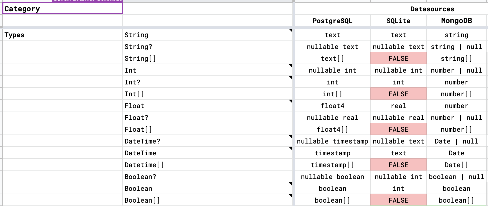

# Capability Matrix

The capability matrix adds support granular control over API features based on the underlying datasources. This document describes how to merge the capabilities
of the datasource and your application schema into a custom API for your application.

## Data Type: Table => JSON

First we start with a compatibility table:



> Where the information is stored doesn't matter. This might be in Excel or it might be in code. We'll likely want a higher-level representation than the
> grammar to make it easy to adjust.

This table will get parsed and translated into the following AST:

```json
{
  "type": "Capabilities",
  "dataTypeMap": [
    {
      "type": "CapabilityTypeMap",
      "datasourceType": {
        "type": "CapabilityScalarType",
        "name": "text"
      },
      "coreType": {
        "type": "StringType"
      }
    },
    {
      "type": "CapabilityTypeMap",
      "datasourceType": {
        "type": "CapabilityOptionalType",
        "elementType": {
          "type": "CapabilityScalarType",
          "name": "text"
        }
      },
      "coreType": {
        "type": "OptionalType",
        "elementType": {
          "type": "StringType"
        }
      }
    },
    {
      "type": "CapabilityTypeMap",
      "datasourceType": {
        "type": "CapabilityListType",
        "elementType": {
          "type": "CapabilityScalarType",
          "name": "text"
        }
      },
      "coreType": {
        "type": "ListType",
        "elementType": {
          "type": "StringType"
        }
      }
    },
    {
      "type": "CapabilityTypeMap",
      "datasourceType": {
        "type": "CapabilityScalarType",
        "name": "int"
      },
      "coreType": {
        "type": "IntType"
      }
    },
    {
      "type": "CapabilityTypeMap",
      "datasourceType": {
        "type": "CapabilityOptionalType",
        "elementType": {
          "type": "CapabilityScalarType",
          "name": "int"
        }
      },
      "coreType": {
        "type": "OptionalType",
        "elementType": {
          "type": "IntType"
        }
      }
    },
    {
      "type": "CapabilityTypeMap",
      "datasourceType": {
        "type": "CapabilityListType",
        "elementType": {
          "type": "CapabilityScalarType",
          "name": "int"
        }
      },
      "coreType": {
        "type": "ListType",
        "elementType": {
          "type": "IntType"
        }
      }
    },
    {
      "type": "CapabilityTypeMap",
      "datasourceType": {
        "type": "CapabilityScalarType",
        "name": "float4"
      },
      "coreType": {
        "type": "StringType"
      }
    },
    {
      "type": "CapabilityTypeMap",
      "datasourceType": {
        "type": "CapabilityOptionalType",
        "elementType": {
          "type": "CapabilityScalarType",
          "name": "float4"
        }
      },
      "coreType": {
        "type": "OptionalType",
        "elementType": {
          "type": "StringType"
        }
      }
    },
    {
      "type": "CapabilityTypeMap",
      "datasourceType": {
        "type": "CapabilityListType",
        "elementType": {
          "type": "CapabilityScalarType",
          "name": "float4"
        }
      },
      "coreType": {
        "type": "ListType",
        "elementType": {
          "type": "StringType"
        }
      }
    },
    {
      "type": "CapabilityTypeMap",
      "datasourceType": {
        "type": "CapabilityScalarType",
        "name": "timestamp"
      },
      "coreType": {
        "type": "DateTimeType"
      }
    },
    {
      "type": "CapabilityTypeMap",
      "datasourceType": {
        "type": "CapabilityOptionalType",
        "elementType": {
          "type": "CapabilityScalarType",
          "name": "timestamp"
        }
      },
      "coreType": {
        "type": "OptionalType",
        "elementType": {
          "type": "DateTimeType"
        }
      }
    },
    {
      "type": "CapabilityTypeMap",
      "datasourceType": {
        "type": "CapabilityListType",
        "elementType": {
          "type": "CapabilityScalarType",
          "name": "timestamp"
        }
      },
      "coreType": {
        "type": "ListType",
        "elementType": {
          "type": "DateTimeType"
        }
      }
    },
    {
      "type": "CapabilityTypeMap",
      "datasourceType": {
        "type": "CapabilityScalarType",
        "name": "boolean"
      },
      "coreType": {
        "type": "BooleanType"
      }
    },
    {
      "type": "CapabilityTypeMap",
      "datasourceType": {
        "type": "CapabilityOptionalType",
        "elementType": {
          "type": "CapabilityScalarType",
          "name": "boolean"
        }
      },
      "coreType": {
        "type": "OptionalType",
        "elementType": {
          "type": "BooleanType"
        }
      }
    },
    {
      "type": "CapabilityTypeMap",
      "datasourceType": {
        "type": "CapabilityListType",
        "elementType": {
          "type": "CapabilityScalarType",
          "name": "boolean"
        }
      },
      "coreType": {
        "type": "ListType",
        "elementType": {
          "type": "BooleanType"
        }
      }
    }
  ],
  "expressionMap": [],
  "functionMap": []
}
```
