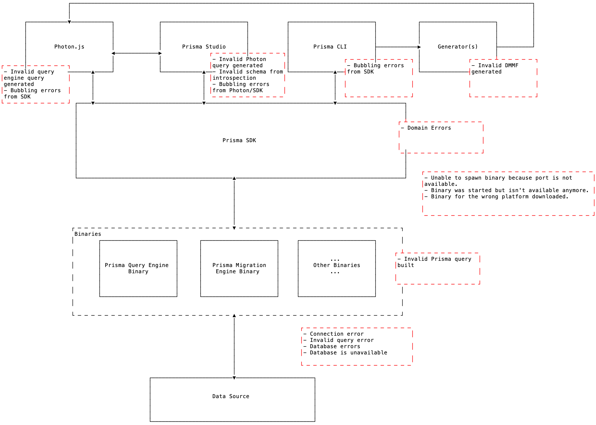

# Errors

- Owner: @divyenduz
- Stakeholders: @mavilein @timsuchanek @nikolasburk
- State:
  - Spec: In Progress 🚧
  - Implementation: Future 👽

Definition of errors in Prisma Framework. (In this document we make the distinction between [Unknown Errors](https://github.com/prisma/specs/tree/master/errors#unknown-errors) and [Known Errors](https://github.com/prisma/specs/tree/master/errors#known-errors).)

---

<!-- START doctoc generated TOC please keep comment here to allow auto update -->
<!-- DON'T EDIT THIS SECTION, INSTEAD RE-RUN doctoc TO UPDATE -->


- [Motivation](#motivation)
- [Error Causes and Handling Strategies](#error-causes-and-handling-strategies)
- [Error Codes](#error-codes)
- [Known Errors](#known-errors)
  - [Known Errors Template](#known-errors-template)
  - [Prisma SDK](#prisma-sdk)
    - [Common](#common)
      - [P1000: Incorrect database credentials](#p1000-incorrect-database-credentials)
      - [P1001: Database not reachable](#p1001-database-not-reachable)
      - [P1002: Database timeout](#p1002-database-timeout)
      - [P1003: Database does not exist](#p1003-database-does-not-exist)
      - [P1004: Incompatible binary](#p1004-incompatible-binary)
      - [P1005: Unable to start the query engine](#p1005-unable-to-start-the-query-engine)
      - [P1006: Binary not found](#p1006-binary-not-found)
      - [P1007: Missing write access to download binary](#p1007-missing-write-access-to-download-binary)
      - [P1008: Database operation timeout](#p1008-database-operation-timeout)
      - [P1009: Database already exists](#p1009-database-already-exists)
      - [P1010: Database access denied](#p1010-database-access-denied)
    - [Query Engine](#query-engine)
      - [P2000: Input value too long](#p2000-input-value-too-long)
      - [P2001: Record not found](#p2001-record-not-found)
      - [P2002: Unique key violation](#p2002-unique-key-violation)
      - [P2003: Foreign key violation](#p2003-foreign-key-violation)
      - [P2004: Constraint violation](#p2004-constraint-violation)
      - [P2005: Stored value is invalid](#p2005-stored-value-is-invalid)
      - [P2006: `*`Type mismatch: invalid (ID/Date/Json/Enum)](#p2006-type-mismatch-invalid-iddatejsonenum)
      - [P2007: `*`Type mismatch: invalid custom type](#p2007-type-mismatch-invalid-custom-type)
      - [P2008: Query parsing failed](#p2008-query-parsing-failed)
      - [P2009: Query validation failed](#p2009-query-validation-failed)
    - [Migration Engine](#migration-engine)
      - [P3000: Database creation failed](#p3000-database-creation-failed)
      - [P3001: Destructive migration detected](#p3001-destructive-migration-detected)
      - [P3002: Migration rollback](#p3002-migration-rollback)
    - [Introspection Engine](#introspection-engine)
      - [P4000: Introspection failed](#p4000-introspection-failed)
    - [Schema Parser](#schema-parser)
      - [P5000: Schema parsing failed](#p5000-schema-parsing-failed)
      - [P5001: Schema relational ambiguity](#p5001-schema-relational-ambiguity)
      - [P5002: Schema string input validation errors](#p5002-schema-string-input-validation-errors)
  - [Photon.js](#photonjs)
      - [Photon runtime validation error](#photon-runtime-validation-error)
      - [Query engine connection error](#query-engine-connection-error)
  - [Prisma Studio](#prisma-studio)
  - [Prisma CLI](#prisma-cli)
    - [Init](#init)
      - [Directory already contains schema file](#directory-already-contains-schema-file)
      - [Starter kit](#starter-kit)
    - [Generate](#generate)
    - [Dev](#dev)
    - [Lift](#lift)
    - [Introspect](#introspect)
  - [Programmatic access](#programmatic-access)
- [Unknown Errors](#unknown-errors)
  - [Unknown Error Template](#unknown-error-template)
  - [Unknown Error Handling](#unknown-error-handling)
    - [Photon.js](#photonjs-1)
    - [Studio](#studio)
    - [CLI](#cli)
- [Error Log Masking](#error-log-masking)
- [Open Questions?](#open-questions)

<!-- END doctoc generated TOC please keep comment here to allow auto update -->

# Motivation



| Component            | Description                                                                                        |
| -------------------- | -------------------------------------------------------------------------------------------------- |
| Systems that use SDK | Photon.js, Studio, Prisma CLI: dev, lift, generate commands, etc.                                  |
| Prisma SDK           | Helps tools interact with binaries. Spec [here](../sdk-js/Readme.md)                               |
| Core                 | Binary artifacts of Prisma 2 compilation and a part of the SDK. Spec [here](../binaries/Readme.md) |
| Data source          | A database or any other data source supported by Prisma                                            |

Prisma 2 ecosystem provides various layers of tools that communicate with each other to provide desired outcome.

Broadly, the life-cycle of a request (Query request or CLI command) can be seen in this diagram.

| System that uses SDK | →   | Prisma SDK | →   | Binaries | →   | Data source |
| -------------------- | --- | ---------- | --- | -------- | --- | ----------- |


Note: This spec is primarily targeted at users who would build tools using the Prisma SDK. The spec also targets users of those tools.

# Error Causes and Handling Strategies

There can be various reasons for a request/operation to fail. This section broadly classifies potential error causes and handling strategies.

<details>
<summary>Validation Errors</summary>
<p>
These are usually caused by faulty user input. For example,

- Incorrect database credentials
- Invalid data source URL
- Malformed schema syntax

Handling strategy: Any user input must be validated and user should be notified about the validation error details.

</p>
</details>

<details>
<summary>Data Error</summary>
<p>These are usually caused when a database constraint fails. For example,

- Record not found
- Unique constraint violation
- Foreign key constraint violation
- Custom constraint violation

Handling strategy: Domain errors would usually originate from the data source and the underlying message should be relayed to the user with some context.

</p>
</details>

<details>
<summary>Runtime Error</summary>
<p>
These are caused due to an error in Prisma runtime. For example,

- The available binary is not compiled for this platform
- SDK failed to bind a port for query engine
- Database is not reachable
- Database timeout

Handling strategy: Notify the user by relaying the message from OS/Database and suggesting them to retry. They might need to free up resources or do something at the OS level.

In certain cases, like when a port collision, Prisma SDK can try to retry gracefully as well with a different port.

</p>
</details>

# Error Codes

Error codes make identification/classification of error easier. Moreover, we can have internal range for different system components

| Tool (Binary)        | Range | Description                                                                                                                                                                      |
| -------------------- | ----- | -------------------------------------------------------------------------------------------------------------------------------------------------------------------------------- |
| Common               | 1000  | Common errors across all binaries. Common by itself is not a binary.                                                                                                             |
| Query Engine         | 2000  | Query engine binary is responsible for getting data from data sources via connectors (This powers Photon). The errors in this range would usually be data constraint errors      |
| Migration Engine     | 3000  | Migration engine binary is responsible for performing database migrations (This powers lift). The errors in this range would usually be schema migration/data destruction errors |
| Introspection Engine | 4000  | Introspection engine binary is responsible for printing Prisma schema from an existing database. The errors in this range would usually be errors with schema inferring          |
| Schema Parser        | 5000  | Schema parser is responsible for parsing the Prisma schema file. The errors in this range are usually syntactic or semantic errors.                                              |
| Prisma Format        | 6000  | Prisma format powers the Prisma VSCode extension to pretty print the Prisma schema. The errors in this range are usually syntactic or semantic errors.                           |

# Known Errors

## Known Errors Template

When we encounter a known error, we should try to convey enough information to the user so they get a good understanding of the error and can possibly unblock themselves.

The format of our error should be the following:

```
{error_code}: {error_message}

{serialized_meta_schema}

Read more: {code_link}
```

| Template Field         | Description                                                                          |
| ---------------------- | ------------------------------------------------------------------------------------ |
| error_code             | Code identifier of the encountered error                                             |
| error_message          | Error message description that also contains a one liner for "how to fix" suggestion |
| serialized_meta_schema | Serialization of the meta schema that might different for each error                 |
| code_link              | Each error code has a permalink with detailed information                            |

If we encounter a Rust panic, that is covered in the [Unknown Errors](#unknown-errors) section.

## Prisma SDK

SDK acts as the interface between the binaries and the tools. This section covers errors from SDK, binaries and the network between SDK ⇆ Binary and Binary ⇆ Data source.

### Common

#### P1000: Incorrect database credentials

- **Description**: Authentication failed against database server at `${database_host}`, the provided database credentials for `${database_user}` are not valid. <br /> <br /> Please make sure to provide valid database credentials for the database server at `${database_host}`.
- **Meta schema**:

  ```ts
  type Meta = {
    // Database host URI
    database_host: string

    // Database user name
    database_user: string
  }
  ```

- **Notes**: Might vary for different data source, For example, SQLite has no concept of user accounts, and instead relies on the file system for all database permissions. This makes enforcing storage quotas difficult and enforcing user permissions impossible.

#### P1001: Database not reachable

- **Description**: Can't reach database server at `${database_host}`:`${database_port}` <br /> <br /> Please make sure your database server is running at `${database_host}:${database_port}`.
- **Meta schema**:

  ```ts
  type Meta = {
    // Database host URI
    database_host: string

    // Database port
    database_port: number
  }
  ```

#### P1002: Database timeout

- **Description**: The database server at `${database_host}`:`${database_port}` was reached but timed out. <br /> <br /> Please try again. <br /> <br /> Please make sure your database server is running at `${database_host}:${database_port}`.
- **Meta schema**:

  ```ts
  type Meta = {
    // Database host URI
    database_host: string

    // Database port
    database_port: string
  }
  ```

#### P1003: Database does not exist

- **Description**: MySQL, Postgres: Database `${database_name}` does not exist on the database server at `${database_host}`. <br /> <br /> SQLite: Database `${database_file_name}` does not exist on the database server at `${database_file_path}`
- **Meta schema**:

  ```ts
  type Meta = {
    // Database name for all data sources that support a database name
    // SQLite: File name of the database
    database_name: string

    // Postgres only: Database schema name
    database_schema_name: string

    // All data sources that have a database host URI
    // SQLite: Path to the database file
    database_host: string
  }
  ```

- **Notes**: Different consumers of the SDK might handle that differently. Lift save, for example, shows a interactive dialog for user to create it.

#### P1004: Incompatible binary

- **Description**: The downloaded/provided binary `${binary_path}` is not compiled for platform `${platform}`
- **Meta schema**:

  ```ts
  type Meta = {
    // Fully resolved path of the binary file
    binary_path: string

    // Identifiers for the currently identified execution environment, e.g. `native`, `windows`, `darwin` etc
    platform: string
  }
  ```

#### P1005: Unable to start the query engine

- **Description**: Failed to spawn the binary `${binary_path}` process for platform `${platform}`
- **Meta schema**:

  ```ts
  type Meta = {
    // Fully resolved path of the binary file
    binary_path: string

    // Identifiers for the currently identified execution environment, e.g. `native`, `windows`, `darwin` etc
    platform: string
  }
  ```

#### P1006: Binary not found

- **Description**: Photon binary for current platform `${platform}` could not be found. Make sure to adjust the generator configuration in the `schema.prisma` file. <br /> <br />`${generator_config}` <br /> <br />Please run `prisma2 generate` for your changes to take effect.
- **Meta schema**:

  ```ts
  type Meta = {
    // Identifiers for the currently identified execution environment, e.g. `native`, `windows`, `darwin` etc
    platform: string

    // Details of how a generator can be added.
    generator_config: string
  }
  ```

- **Notes**: Tools (like Primsa CLI) consuming `generator_config` might color it using ANSI characters for better reading experience.

#### P1007: Missing write access to download binary

- **Description**: Please try installing Prisma 2 CLI again with the `--unsafe-perm` option. <br /> Example: `npm i -g --unsafe-perm prisma2`

#### P1008: Database operation timeout

- **Description**: Operations timed out after `${time}`
- **Meta schema**:
  ```ts
  type Meta = {
    // Operation time in s or ms (if <1000ms)
    time: number
  }
  ```

#### P1009: Database already exists

- **Description**: Database `${database_name}` already exists on the database server at `${database_host}:${database_port}`
- **Meta schema**:

  ```ts
  type Meta = {
    // Database name, append `database_schema_name` when applicable
    // `database_schema_name`: Database schema name (For Postgres for example)
    database_name: string

    // Database host URI
    database_host: string

    // Database port
    database_port: number
  }
  ```

#### P1010: Database access denied

- **Description**: User `${database_user}` was denied access on the database `${database_name}`
- **Meta schema**:

  ```ts
  type Meta = {
    // Database user name
    database_user: string

    // Database name, append `database_schema_name` when applicable
    // `database_schema_name`: Database schema name (For Postgres for example)
    database_name: string
  }
  ```

### Query Engine

Note: Errors with `*` in the title represent multiple types and are less defined.

#### P2000: Input value too long

- **Description**: The value `${field_value}` for the field `${field_name}` is too long for the field's type
- **Meta schema**:

  ```ts
  type Meta = {
    // Concrete value provided for a field on a model in Prisma schema. Should be peeked/truncated if too long to display in the error message
    field_value: string

    // Field name from one model from Prisma schema
    field_name: string
  }
  ```

#### P2001: Record not found

- **Description**: The record searched for in the where condition (`${model_name}.${argument_name} = ${argument_value}`) does not exist
- **Meta schema**:

  ```ts
  type Meta = {
    // Model name from Prisma schema
    model_name: string

    // Argument name from a supported query on a Prisma schema model
    argument_name: string

    // Concrete value provided for an argument on a query. Should be peeked/truncated if too long to display in the error message
    argument_value: string
  }
  ```

#### P2002: Unique key violation

- **Description**: Unique constraint failed on the field: `${field_name}`
- **Meta schema**:
  ```ts
  type Meta = {
    // Field name from one model from Prisma schema
    field_name: string
  }
  ```

#### P2003: Foreign key violation

- **Description**: Foreign key constraint failed on the field: `${field_name}`
- **Meta schema**:
  ```ts
  type Meta = {
    // Field name from one model from Prisma schema
    field_name: string
  }
  ```

#### P2004: Constraint violation

- **Description**: A constraint failed on the database: `${database_error}`
- **Meta schema**:
  ```ts
  type Meta = {
    // Database error returned by the underlying data source
    database_error: string
  }
  ```

#### P2005: Stored value is invalid

- **Description**: The value `${field_value}` stored in the database for the field `${field_name}` is invalid for the field's type
- **Meta schema**:

  ```ts
  type Meta = {
    // Concrete value provided for a field on a model in Prisma schema. Should be peeked/truncated if too long to display in the error message
    field_value: string

    // Field name from one model from Prisma schema
    field_name: string
  }
  ```

#### P2006: `*`Type mismatch: invalid (ID/Date/Json/Enum)

- **Description**: The provided value `${field_value}` for `${model_name}` field `${field_name}` is not valid
- **Meta schema**:

  ```ts
  type Meta = {
    // Concrete value provided for a field on a model in Prisma schema. Should be peeked/truncated if too long to display in the error message
    field_value: string

    // Model name from Prisma schema
    model_name: string

    // Field name from one model from Prisma schema
    field_name: string
  }
  ```

- **Notes**: Details are not finalized. The current idea is that any variable coercion will happen in the query engine. Json might be recognized as a native Prisma scalar. This also brings up the question of shims. Clarity in those parts of the spec would help us answer this. The same questions apply to bring your own ID feature, will we recognize all known ID types (like uuid, cuid, MongoID) and validate them in any later before it hits the database?

#### P2007: `*`Type mismatch: invalid custom type

- **Description**: Data validation error `${database_error}`
- **Meta schema**:
  ```ts
  type Meta = {
    // Database error returned by the underlying data source
    database_error: string
  }
  ```
- **Notes**: Details are not finalized. The current idea is that Photon, Query Engine will simply pass through the data and rely on database for data validation.

#### P2008: Query parsing failed

- **Description**: Failed to parse the query `${query_parsing_error}` at `${query_position}`
- **Meta schema**:

  ```ts
  type Meta = {
    // Error(s) encountered when trying to parse a query in the query engine
    query_parsing_error: string

    // Location of the incorrect parsing, validation in a query. Represented by tuple or object with (line, character)
    query_position: string
  }
  ```

- **Notes**: This is unexpected from Photon (if they do it is a bug in Photon) but they are useful for anyone writing a query builder on top of the query engine.

#### P2009: Query validation failed

- **Description**: Failed to validate the query `${query_validation_error}` at `${query_position}`
- **Meta schema**:

  ```ts
  type Meta = {
    // Error(s) encountered when trying to validate a query in the query engine
    query_validation_error: string

    // Location of the incorrect parsing, validation in a query. Represented by tuple or object with (line, character)
    query_position: string
  }
  ```

- **Notes**: This is unexpected from Photon (if they do it is a bug in Photon) but they are useful for anyone writing a query builder on top of the query engine.

### Migration Engine

#### P3000: Database creation failed

- **Description**: Failed to create database: `${database_error}`
- **Meta schema**:
  ```ts
  type Meta = {
    // Database error returned by the underlying data source
    database_error: string
  }
  ```

#### P3001: Destructive migration detected

- **Description**: Migration possible with destructive changes and possible data loss: `${migration_engine_destructive_details}`
- **Meta schema**:
  ```ts
  type Meta = {
    // Details of a destructive migration from the migration engine
    migration_engine_destructive_details: string
  }
  ```

#### P3002: Migration rollback

- **Description**: The attempted migration was rolled back: `${database_error}`
- **Meta schema**:
  ```ts
  type Meta = {
    // Database error returned by the underlying data source
    database_error: string
  }
  ```

### Introspection Engine

#### P4000: Introspection failed

- **Description**: Introspection operation failed to produce a schema file: `${introspection_error}`
- **Meta schema**:
  ```ts
  type Meta = {
    // Generic error received from the introspection engine. Indicator of why an introspection failed
    introspection_error: string
  }
  ```

### Schema Parser

#### P5000: Schema parsing failed

- **Description**: Failed to parse schema file: `${schema_parsing_error}` at `${schema_position}`
- **Meta schema**:

  ```ts
  type Position = {
    line: number
    character: number
  }

  type Meta = {
    // Error(s) encountered when trying to parse the schema in the schema parser
    schema_parsing_error: string

    // Location of the incorrect parsing, validation in the schema. Represented by tuple or object with (line, character)
    schema_position: Position
  }
  ```

#### P5001: Schema relational ambiguity

- **Description**: There is a relational ambiguity in the schema file between the models `${A}` and `${B}`.
- **Meta schema**:

  ```ts
  type Meta = {
    // Concrete name of model from Prisma schema that has an ambiguity
    A: string

    // Concrete name of model from Prisma schema that has an ambiguity
    B: string
  }
  ```

#### P5002: Schema string input validation errors

- **Description**: Database URL provided in the schema failed to parse: `${schema_sub_parsing_error}` at `${schema_position}`
- **Meta schema**:

  ```ts
  type Position = {
    line: number
    character: number
  }

  type Meta = {
    // Error(s) encountered when trying to parse a string input to the schema in the schema parser (Like database URL)
    schema_sub_parsing_error: string

    // Location of the incorrect parsing, validation in the schema. Represented by tuple or object with (line, character)
    schema_position: Position
  }
  ```

## Photon.js

#### Photon runtime validation error

- **Description**: Validation Error: `${photon_runtime_error}`
- **Meta schema**:

  ```ts
  type Meta = {
    // Photon runtime error describing a validation error like missing argument or incorrect data type.
    photon_runtime_error: string
  }
  ```

- **Notes**: Photon might use ANSI characters to color the response for a better reading experience. Disabling that feature is documented [here](https://github.com/prisma/specs/tree/master/photonjs#error-character-encoding).

#### Query engine connection error

- **Description**: The query engine process died, please restart the application

---

Additionally, Photon relays the following errors from the SDK: `P1000`, `P1001` , `P1002`, `P1003`, `P1004`, `P1005`, `P1006`, `P2000`, `P2001` , `P2002`, `P2003`, `P2004`, `P2005`, `P2006`, `P2007`, `P2008`, `P2009`.

Note: For `P1006`, Photon provides additional information in case it detects that the binary is incorrectly pinned.

## Prisma Studio

Note: Studio has two workflows:

Electron app: Credentials from the UI → Introspection → Prisma schema → Valid Prisma project
Web app: `prisma2 dev` → Provides Prisma schema i.e a Valid Prisma project

Since studio uses Photon for query building. It relays the same error messages as Photon. Additionally, it relays the following errors from the SDK: `P3000`, `P5000`

## Prisma CLI

Note that Prisma CLI must exit with a non-zero exit code when it encounters an error from which it cannot recover.

### Init

#### Directory already contains schema file

- **Description**: Directory `${folder_name}` is an existing Prisma project
- **Meta schema**:

  ```ts
  type Meta = {
    // Folder name of current working directory (Equivalent of folder name from unix `pwd`)
    folder_name: string
  }
  ```

#### Starter kit

- **Description**: Directory `${folder_name}` is not empty
- **Meta schema**:

  ```ts
  type Meta = {
    // Folder name of current working directory (Equivalent of folder name from unix `pwd`)
    folder_name: string
  }
  ```

Init command relays the following errors from the SDK: `P3000`, `P4000`

More issues for init command failures are covered here: https://prisma-specs.netlify.com/cli/init/errors/

### Generate

Generate command relays the following errors from the SDK: `P5000`, `P5001`, `P5002`

### Dev

Dev command relays the following errors from the SDK: `P1000`, `P1001` , `P1002`, `P1003`, `P1004`, `P1005`, `P1006`, `P3000`, `P3001`, `P5000`, `P5001`, `P5002`

### Lift

Lift commands relays the following errors from the SDK: `P1000`, `P1001` , `P1002`, `P1003`, `P1004`, `P1005`, `P1006`, `P3000`, `P3001`, `P5000`, `P5001`, `P5002`

### Introspect

Introspect command relays the following errors from the SDK: `P1000`, `P1001` , `P1002`, `P1003`, `P1004`, `P1005`, `P1006`, `P4000`

## Programmatic access

Many of these errors from the previous section are expected to be consumed programmatically.

`Photon.js`: In user's code base
`Prisma SDK`: Lift etc, in the tools that use Prisma SDK

Therefore, they should be consumable programmatically and have an error structure:

Error object:

```json
{
  "code": "<ERROR_CODE>",
  "message": "<ERROR_MESSAGE>",
  "meta": "<meta-schema-object>"
}
```

Serialization of the error message (default `toString`) will have the following template:

```
${ERROR_CODE}: ${ERROR_MESSAGE}
```

# Unknown Errors

As Prisma 2 is still early, we're not yet aware of all error cases that can occur. This section explains what should happen when Prisma encounters an _unknown_ error.

An error can occur in any of the following tools that currently make up Prisma 2's developer surface area:

- Photon.js
- Studio
- CLI

When an unknown error occurs, **our primary goal** is to get the user to report it by creating a new GitHub issue or send the error report to us via telemetry.

Error messages should include clear guidelines of where to report the issue and what information to include. The following sections provide the templates for these error message per tool.

## Unknown Error Template

Additionally to showing the the error message directly to the user by printing it to the console, we also want to provide rich error reports that users can use to report the issue manually via Github issue or automatically via telemetry. These error reports are stored as markdown files or zip files on the file system. Therefore, each tool has two templates:

- **Logging output** directly shown to the user
- **Error report** (markdown or a zip file) stored on the file system

The error report generally is more exhaustive than the logging output (e.g. it also contains the Prisma schema which would be overkill if printed to the terminal as well). It is also written in Markdown enabling the user to copy and paste the report as a GitHub issue directly.

## Unknown Error Handling

### Photon.js

On encountering an unexpected error, Photon should inform the user and prepare an error report with context of the issue and masked sensitive information to be shared manually or via telemetry.

<details><Summary>Logging output</Summary>

```
Oops, an unexpected error occurred.

Find more info in the error report:
**/path/to/dir/prisma-error-TIMESTAMP.md**

Please help us fix the problem!

Copy the error report and paste it as a GitHub issue here:
**https://www.github.com/prisma/photonjs/issues**

Thanks for helping us making Photon.js more stable! 🙏

An internal error occurred during invocation of **photon.users.create()** in **/path/to/dir/src/.../file.ts**

  ${userStackTrace}
```

> Note: Text enclosed by the double-asterisk `**` means the text should be printed in **bold**.

</details>

<details><Summary>Error report</Summary>

File name: `prisma-error.md` is created inside the project directory on first error and is appended to on subsequent errors.

```
# Error report (Photon JS | July 23, 2019 | 14:42:23 h)

This is an exhaustive report containing all relevant information about the error.

**Please post this report as a GitHub issue so we can fix the problem: https://github.com/prisma/prisma2/issues** 🙏

## Stack trace

${internalStackTrace}

## System info

${uname -a}

## Prisma 2 CLI version

${prisma2 -v}

## Prisma schema file

${schema.prisma}

## Generated Photon JS code

${index.d.ts}
```

> **Note**: The connection strings for the data sources in the Prisma schema file must be obscured!

</details>

### Studio

On encountering an unexpected error, Studio should inform the user and prepare an error report with context of the issue and masked sensitive information to be shared manually or via telemetry.

<details><Summary>Logging output</Summary>

```
Oops, an unexpected error occurred! Find more info in the error report:
**/path/to/dir/prisma-error-TIMESTAMP.md**

Please help us fix the problem!

Copy the error report and paste it as a GitHub issue here:
**https://www.github.com/prisma/prisma2/issues**

Thanks for helping us making Prisma 2 more stable! 🙏
```

> Note: Text enclosed by the double-asterisk `**` means the text should be printed in **bold**.

</details>

<details><Summary>Error report</Summary>

File name: `studio-error-TIMESTAMP.zip` where `TIMESTAMP` is a placeholder for the current timestamp. It would contain the migrations and schema files with sensitive information redacted (see [Error Log Masking](#error-log-masking)) and an information file containing the error report:

```
# Error report (Prisma Studio | July 23, 2019 | 14:42:23 h)

This is an exhaustive report containing all relevant information about the error.

**Please post this report as a GitHub issue so we can fix the problem: https://github.com/prisma/prisma2/issues** 🙏

## Stack trace

${stacktrace}

## System info

${uname -a}

## Browser info

${browserInfo}

## Prisma 2 CLI version

${prisma2 -v}

## Prisma schema file

${schema.prisma}
```

> **Note**: The connection strings for the data sources in the Prisma schema file must be obscured!

</details>

Note that studio can also yield Photon errors as it uses Photon internally. The error log generation in that case would be done by Photon but the UI to prompt user to create a Github issue or send it to us would be handled by Studio.

### CLI

Note that Prisma CLI must exit with a non-zero exit code when it encounters an error from which it cannot recover.

On encountering an unexpected error, CLI should inform the user and prepare an error report with context of the issue.

File name: `prisma-error-TIMESTAMP.zip` where `TIMESTAMP` is a placeholder for the current timestamp. It would contain the migrations and schema files with sensitive information redacted (see [Error Log Masking](#error-log-masking)).

This is covered in the [CLI error handling spec](https://prisma-specs.netlify.com/cli/error-handling/).

# Error Log Masking

Both logging output, error report might contain logs with sensitive information like database URL. Prisma 2 should mask the sensitive information (with asterisks `********`) before dumping the data on the file system.

The error report to be sent back automatically might also contain some proprietary information like the database schema via Prisma schema file.

We must ask the user before collecting such information. This is covered in the [telemetry spec](https://prisma-specs.netlify.com/cli/telemetry/).

# Open Questions?

- Batch API and errors? Discussion https://www.notion.so/prismaio/Errors-Spec-Error-Arrays-4160085305444374a74f6a81b785e57a

- Single errors or error arrays? (in the GraphQL layer for example?) Discussion https://www.notion.so/prismaio/Errors-Spec-Error-Arrays-4160085305444374a74f6a81b785e57a

- Error slugs in place of error codes like: https://github.com/typescript-eslint/typescript-eslint/tree/master/packages/eslint-plugin/src/rules
  -- A downside of error codes is that it makes reordering errors (in the spec) cumbersome.

- Should known errors have a CTA? To create a GH issue? That might help funnel user input for better developer experience. This also teaches users about multiple repositories.
