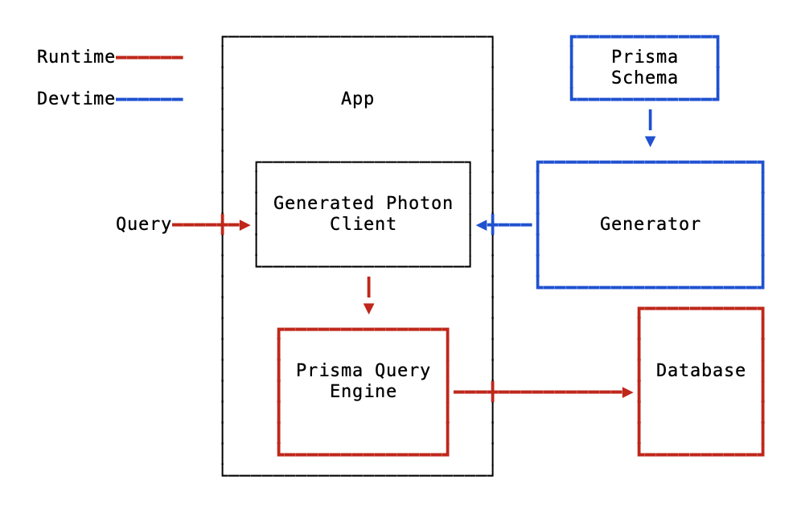

# Prisma Client JS

- Stakeholders: @sorenbs @timsuchanek @schickling
- State:
  - Spec: Unknown Documenting existing implementation. Still WIP.
  - Implementation: Mostly implemented

This spec describes the Prisma Client Javascript API

---

<!-- START doctoc generated TOC please keep comment here to allow auto update -->
<!-- DON'T EDIT THIS SECTION, INSTEAD RE-RUN doctoc TO UPDATE -->

- [Background](#background)
  - [Goals for the Prisma Client JS API](#goals-for-the-prisma-client-js-api)
- [Client Layout](#client-layout)
  - [A note on Promises](#a-note-on-promises)
- [Logging](#logging)
- [Errors](#errors)
  - [1. `PrismaClientValidationError`](#1-prismaclientvalidationerror)
  - [2. `PrismaClientKnownRequestError`](#2-prismaclientknownrequesterror)
  - [3. `PrismaClientUnknownRequestError`](#3-prismaclientunknownrequesterror)
  - [4. `PrismaClientRustPanicError`](#4-prismaclientrustpanicerror)
  - [5. `PrismaClientInitializationError`](#5-prismaclientinitializationerror)
  - [Discriminating error types](#discriminating-error-types)
- [Error Formatting](#error-formatting)
  - [Environment variables](#environment-variables)
  - [Constructor args](#constructor-args)
- [Reading data](#reading-data)
  - [Default selection set](#default-selection-set)
  - [Find a single record](#find-a-single-record)
    - [where](#where)
    - [include](#include)
      - [Including a to-one relation](#including-a-to-one-relation)
      - [Including multiple relation-hops](#including-multiple-relation-hops)
      - [Include a to-many relation and use relation arguments](#include-a-to-many-relation-and-use-relation-arguments)
    - [select](#select)
  - [Find multiple records](#find-multiple-records)
    - [where](#where-1)
      - [Exact match and advanced filters](#exact-match-and-advanced-filters)
      - [Boolean combinators](#boolean-combinators)
      - [Syntax inconsistency between findOne and findMany](#syntax-inconsistency-between-findone-and-findmany)
    - [pagination: before, after, first, last, skip](#pagination-before-after-first-last-skip)
  - [Raw database access](#raw-database-access)
    - [Raw Usage](#raw-usage)
- [Writing data](#writing-data)
  - [Create a single record](#create-a-single-record)
    - [data](#data)
      - [Scalar fields](#scalar-fields)
      - [To-one relation fields](#to-one-relation-fields)
      - [To-many relation fields](#to-many-relation-fields)
    - [Include and select](#include-and-select)
  - [Delete a single record](#delete-a-single-record)
    - [where](#where-2)
    - [Include and select](#include-and-select-1)
  - [Delete multiple records](#delete-multiple-records)
    - [where](#where-3)
  - [Update a single record](#update-a-single-record)
    - [where](#where-4)
    - [data](#data-1)
      - [Scalar fields](#scalar-fields-1)
      - [To-one relation fields](#to-one-relation-fields-1)
      - [To-many relation fields](#to-many-relation-fields-1)
    - [](#)
    - [Include and select](#include-and-select-2)
- [`undefined` vs `null`](#undefined-vs-null)
  - [Write: Updating a User](#write-updating-a-user)
    - [`undefined`](#undefined)
    - [`null`](#null)
  - [Read: Fetching multiple Users](#read-fetching-multiple-users)
  - [Cases in which only `undefined` is allowed](#cases-in-which-only-undefined-is-allowed)

<!-- END doctoc generated TOC please keep comment here to allow auto update -->

# Background

Prisma Query Engine performs efficient data retrieval from various datasources. A generated Prisma Client provides an ergonomic interface for developers working with Prisma. This spec describes the leftmost arrow in the diagram below labelled "Query".



Prisma is designed to decouple the data retrieval work done by Prisma Query engine from the interface exposed to developers through the generated Prisma Client. This enables us to optimise Prisma Client API for every language we target. It is a goal to be as language-idiomatic as possible.

### Goals for the Prisma Client JS API

- Provide an API that is intuitive for JavaScript developers
- Take advantage of TypeScript to provide the best possible typesafe API

# Client Layout

The client is generated from a Prisma Schema. When imported, it already contain any required configuration:

```ts
import { PrismaClient } from '@prisma/client'
const prisma = new PrismaClient()
```

The client has two methods for connection handling:

```ts
prisma.connect(): Promise<void>
prisma.disconnect(): Promise<void>
```

The only other fields present on the top-level PrismaClient object is a field for each of your models. If you have two models named `Post` and `User` in your Prisma Schema, the `prisma` object could look like this:

```ts
{
  connect(): Promise<void>,
  disconnect(): Promise<void>,
  post: PostDelegate,
  user: UserDelegate
}
```

### A note on Promises

Any method that performs IO will return a promise. Or to be more precise, a promise-like object. They work like promises, but have extra fields and methods to enable the elegant chaining API. The TypeScript definition for such a Promise might look like this:

```ts
declare class PostClient<T> implements Promise<T>
```

In the following we will ignore this detail, and simply write type declarations like this:

```ts
Promise<Post>
```

# Logging

All Prisma Query engine related logs can be configured with the `log` property in the PrismaClient constructor.
These are examples how to specify different log levels:

Just providing the log levels, stdout as default.

```ts
const prismaClient = new PrismaClient({
  log: ['info', 'query'],
})
```

Changing on a per log level, where the logs end up: As an event or in stdout.

```ts
const prismaClient = new PrismaClient({
  log: [
    {
      level: 'info',
      emit: 'stdout',
    },
    {
      level: 'query',
      emit: 'event',
    },
    'warn',
  ],
})

prismaClient.on('query', (e) => {
  console.log(e.timestamp, e.query, e.params)
})
```

Log level names get mapped to the event name for the event emitter.

```ts
const prismaClient = new PrismaClient({
  log: [
    {
      level: 'info',
      emit: 'event',
    },
    {
      level: 'query',
      emit: 'event',
    },
    {
      level: 'warn',
      emit: 'event',
    },
  ],
})

prismaClient.on('query', (e) => {
  e.timestamp
  e.query
  e.params
  e.duration
  e.target
  console.log(e)
})

prismaClient.on('info', (e) => {
  e.timestamp
  e.message
  e.target
  console.log(e)
})

prismaClient.on('warn', (e) => {
  e.timestamp
  e.message
  e.target
  console.log(e)
})
```

# Errors

These are the different kinds of errors that can occur in the Prisma Client:

### 1. `PrismaClientValidationError`

If the input to a query is incorrect, a Validation Error is being thrown.
An example could be a missing field or an incorrect type of a field that is being provided
to the Prisma Client.

### 2. `PrismaClientKnownRequestError`

As soon as the validation was successful, Prisma Client sends the query request to the query engine.
The query engine might now return an error related to the request.
This could e.g. be a unique constraint violation while creating a record.
All `PrismaClientRequestError`s have a `code` property and optionally a `meta` property including relevant meta information to the error.

### 3. `PrismaClientUnknownRequestError`

While the query engine knows many of the possible errors, that can occur, it doesn't know all of them.
This error can be an edge-case, that doesn't occur often, which didn't get a `code` assigned to it yet.
While this is an unknown error, this kind of error does **not** crash the query engine and it can continue running.

### 4. `PrismaClientRustPanicError`

In rare cases, the query engine, which is written in Rust, panics.
This means, that the engine crashes and exits with a non-zero exit code.
In this case, the Prisma Client or the whole Node Process has to be restarted.

### 5. `PrismaClientInitializationError`

As soon as `prisma.connect()` is called or the first request is performed, the Client starts the query engine binary. During this startup of the binary, things can go wrong.
Examples:

- The port, on which the query engine http server wants to bind on, can e.g. already be taken.
- The schema might not validate, because an environment variable is missing.

## Discriminating error types

In order to handle different kinds of errors, `instanceof` can be used:

```ts
import { PrismaClient, PrismaClientRequestError } from '@prisma/client'

const client = new PrismaClient()

try {
  await client.user.create({ data: { email: 'alreadyexisting@mail.com' } })
} catch (e) {
  if (e instanceof PrismaClientRequestError) {
    // The .code property can be accessed in a type-safe manner
    if (e.code === 'P2002') {
      console.log('We got a unique constraint violation')
    }
  }
  throw e
}
```

# Error Formatting

By default, Prisma Client uses ANSI escape characters to pretty print the error stack and give recommendations on how to fix a problem facing with Prisma Client. While this is very useful when using Prisma Client from the terminal, in contexts like a GraphQL api, you only want the minimal error without any additional formatting.

This is how error formatting can be configured with Prisma Client JS.

There are 3 error formatting levels:

1. **Colorless Error**: Includes a full stack trace, syntax highlighting of the code and extended error message with a possible solution for the problem. (_default_)
2. **Pretty Error**: Same as colorless errors, but with colors.
3. **Minimal Error**: Just the pure error message.

In order to configure these different error formatting levels, we have two options: Environment variables and the `PrismaClient` constructor.

## Environment variables

1. `NO_COLOR`: If this env var is provided, colors are stripped from the error message. Therefore we end up with a **colorless error**. The `NO_COLOR` environment variable is a standard described [here](https://no-color.org/). We have a tracking issue [here](https://github.com/prisma/prisma2/issues/686).
2. `NODE_ENV=production`: If the env var `NODE_ENV` is set to `production`, only the **minimal error** will be printed. This allows for easier digestion of logs in production environments.

## Constructor args

The constructor argument to control the error formatting is called `errorFormat`. It can have the following values:

- `undefined`: If it's not defined, the default is `colorless`
- `pretty`: Enables pretty error formatting
- `colorless`: Enables colorless error formatting
- `minimal`: Enables minimal error formatting

It can be used like so:

```ts
const prisma = new PrismaClient({
  errorFormat: 'pretty',
})
```

As the `errorFormat` property is optional, you still can just instantiate Prisma Client like this:

```ts
const prisma = new PrismaClient()
```

# Reading data

There are two methods related to reading records:

```ts
prisma.post.findOne([args]): Promise<Post>
prisma.post.findMany([args]): Promise<Post[]>
```

### Default selection set

By default, Prisma Client returns all scalar fields on a record, and no related records. This behavior can be decided on a per-query basis using the `include` and `select` fields described below.

## Find a single record

Retrieves a single record that can be unambiguously identified by a single unique field or a combination of fields that together are unique.

```ts
prisma.post.findOne([args]): Promise<Post>
```

args is an object with a single required field `where` and two optional fields `include` and `select`.

Example:

```ts
const singlePost = await prisma.post.findOne({
	where: { id: "post-1" }
	include: { author: true }
})
```

### where

The `where` field is used to specify the fields to look up by. It contains another object with an optional field for each unique field combination:

```prisma
model Post {
	id 		   Int  	@id
	email 	 String @unique
	category String
	title    String
	@@unique([category, title])
}
```

The above schema results in a `where` argument with the following type signature:

```ts
type where = {
  id?: number
  email?: string
  category_title?: { category: string; title: string }
}
```

Only a single field may be used in a query, otherwise the call will error without performing the query.

### include

The `include` field is used to specify relations that should be retrieved together with the record. Related records will contain all scalar fields[LINK!] by default. If the related record also have relations, it is possible to include them as well. There is no limit to how deeply you can include relations. For to-many relations, you can also use the normal `findMany` arguments [LINK!] to filter, paginate etc.

#### Including a to-one relation

```prisma
model Post {
	author User
}

model User {
	posts Post[]
}
```

The above schema results in a `include` argument that can be used as follows:

```ts
{
  include: {
    author: true
  }
}
```

#### Including multiple relation-hops

```prisma
model Post {
	author User
}

model User {
	posts 	 Post[]
	friends: User[]
}
```

The above schema results in a `include` argument that can be used as follows:

```ts
{
  include: {
    author: {
      friends: true
    }
  }
}
```

#### Include a to-many relation and use relation arguments

```prisma
model Post {
	comments Comment[]
}

model Comment {
	text String
}
```

The above schema results in a `include` argument that can be used as follows:

```ts
{
  include: {
    comments: {
      skip: 10,
      first: 10
    }
  }
}
```

### select

The `select` field is used to override the default selection set [LINK!]. When present, only scalar fields and relations explicitly requested are returned:

```prisma
model Post {
  title		 String
	comments Comment[]
}

model Comment {
	text String
}
```

The above schema results in a `select` argument that can be used as follows:

```ts
{
  select: {
    title: true
    comments: {
      skip: 10,
      first: 10
    }
  }
}
```

Note that `select` and `include` cannot be combined.

## Find multiple records

Retrieves a list of records that match the filter criteria in the `where` field:

```ts
prisma.post.findMany([args]): Promise<Post[]>
```

args is an object with 9 optional fields `where`,`before`, `after`, `first`, `last`, `skip`, `orderBy`, `select`, `include`.

Example:

```ts
prisma.post.findMany({
  first: 10,
  where: {
    title: { contains: 'abba' },
  },
})
```

> return the first 10 posts where the title contains "abba"

`findMany` always returns a list containing 0, 1 or many records.

### where

The `where` field is used to specify the filter to apply when selecting records to return. Unlike `findOne`, the filter can use any field(s), not just unique fields. It contains an optional field for each field on the model:

```prisma
model Post {
	id 		   Int  	@id
	email 	 String @unique
	category String
	title    String
}
```

```ts
type where = {
  id: number | NumberFilter | null
  email: string | StringFilter | null
  category: string | StringFilter | null
  title: string | StringFilter | null
  AND: Enumerable<PostWhereInput> | null
  OR: Enumerable<PostWhereInput> | null
  NOT: Enumerable<PostWhereInput> | null
}
```

#### Exact match and advanced filters

Prisma Client support supplying an exact match filter directly, or using one of the more advanced filters:

```ts
export declare type StringFilter = {
  equals?: string | null
  not?: string | StringFilter | null
  in?: Enumerable<string> | null
  notIn?: Enumerable<string> | null
  lt?: string | null
  lte?: string | null
  gt?: string | null
  gte?: string | null
  contains?: string | null
  startsWith?: string | null
  endsWith?: string | null
}
export declare type DateTimeFilter = {
  equals?: Date | string | null
  not?: Date | string | DateTimeFilter | null
  in?: Enumerable<Date | string> | null
  notIn?: Enumerable<Date | string> | null
  lt?: Date | string | null
  lte?: Date | string | null
  gt?: Date | string | null
  gte?: Date | string | null
}
export declare type BooleanFilter = {
  equals?: boolean | null
  not?: boolean | BooleanFilter | null
}
export declare type IntFilter = {
  equals?: number | null
  not?: number | IntFilter | null
  in?: Enumerable<number> | null
  notIn?: Enumerable<number> | null
  lt?: number | null
  lte?: number | null
  gt?: number | null
  gte?: number | null
}
export declare type FloatFilter = {
  equals?: number | null
  not?: number | FloatFilter | null
  in?: Enumerable<number> | null
  notIn?: Enumerable<number> | null
  lt?: number | null
  lte?: number | null
  gt?: number | null
  gte?: number | null
}
```

Exact Match examples:

```ts
prisma.post.findMany({
  where: {
    title: 'abba is my favourite group!',
  },
})

prisma.post.findMany({
  where: {
    title: 'abba is my favourite group!',
    category: '1980 music',
  },
})
```

Advanced Filter examples:

```ts
prisma.post.findMany({
  where: {
    title: { startsWith: 'abba' },
  },
})

prisma.post.findMany({
  where: {
    title: { not: { contains: 'abba' } },
    id: { lt: 47 },
  },
})
```

#### Boolean combinators

Prisma Client supports 3 boolean combinators: `OR`, `NOT`, `AND`, that all take an array of objects with the exact same shape as the `where` argument.

Either the title or id field must match the creiterias:

```ts
prisma.post.findMany({
  where: {
    OR: [{ title: { not: { contains: 'abba' } } }, { id: { lt: 47 } }],
  },
})
```

Neither the title nor id field must match the creiterias:

```ts
prisma.post.findMany({
  where: {
    NOT: [{ title: { not: { contains: 'abba' } } }, { id: { lt: 47 } }],
  },
})
```

Both the title or id field must match the creiterias (above). This is equivalent to the simplified form not using the `AND` combinator (below):

```ts
prisma.post.findMany({
  where: {
    AND: [{ title: { not: { contains: 'abba' } } }, { id: { lt: 47 } }],
  },
})
```

```ts
prisma.post.findMany({
  where: {
    title: { not: { contains: 'abba' } },
    id: { lt: 47 },
  },
})
```

#### Syntax inconsistency between findOne and findMany

The syntax for finding a single record that can be uniquely identified by two or more fields using the `findOne` API is different from returning that same record using the `findMany` API. This is due to the implementation complexity of supporting that same API in the `findOne` case:

```prisma
model Post {
	category String
	title    String
	@@id([category, title])
}
```

> Note: `@@id` is not supported yet

```ts
prisma.post.findOne({
  where: {
    category_title: {
      category: '1980 music',
      title: 'abba is my favourite group!',
    },
  },
})
```

```ts
prisma.post.findMany({
  where: {
    category: '1980 music',
    title: 'abba is my favourite group!',
  },
})
```

## Pagination

Pagination has 2 concepts: `cursor` and `take`.

- `cursor` sets the position in the list
- `take` selects either forward or backward from that cursor.

Here are some various settings:

```
                  cursor: 5
                      │
                      │
                      │
                      ▼
┌───┐┌───┐┌───┐┌───┐┏━━━┓┏━━━┓┏━━━┓┌───┐┌───┐┌───┐
│ 1 ││ 2 ││ 3 ││ 4 │┃ 5 ┃┃ 6 ┃┃ 7 ┃│ 8 ││ 9 ││10 │
└───┘└───┘└───┘└───┘┗━━━┛┗━━━┛┗━━━┛└───┘└───┘└───┘
                      ──────────▶
                        take: 3


                  cursor: 5
                      │
                      │
                      │
                      ▼
┌───┐┌───┐┌───┐┏━━━┓┏━━━┓┌───┐┌───┐┌───┐┌───┐┌───┐
│ 1 ││ 2 ││ 3 │┃ 4 ┃┃ 5 ┃│ 6 ││ 7 ││ 8 ││ 9 ││10 │
└───┘└───┘└───┘┗━━━┛┗━━━┛└───┘└───┘└───┘└───┘└───┘
               ◀────────
                take: -2


                  cursor: 5
                      │
                      │
                      │
                      ▼
┌───┐┌───┐┌───┐┌───┐┏━━━┓┌───┐┌───┐┌───┐┌───┐┌───┐
│ 1 ││ 2 ││ 3 ││ 4 │┃ 5 ┃│ 6 ││ 7 ││ 8 ││ 9 ││10 │
└───┘└───┘└───┘└───┘┗━━━┛└───┘└───┘└───┘└───┘└───┘
                   take: -1


                  cursor: 5
                      │
                      │
                      │
                      ▼
┌───┐┌───┐┌───┐┌───┐┏━━━┓┌───┐┌───┐┌───┐┌───┐┌───┐
│ 1 ││ 2 ││ 3 ││ 4 │┃ 5 ┃│ 6 ││ 7 ││ 8 ││ 9 ││10 │
└───┘└───┘└───┘└───┘┗━━━┛└───┘└───┘└───┘└───┘└───┘
                    take: 1


                  cursor: 5
                      │
                      │
                      │
                      ▼
┌───┐┌───┐┌───┐┌───┐┌───┐┌───┐┌───┐┌───┐┌───┐┌───┐
│ 1 ││ 2 ││ 3 ││ 4 ││ 5 ││ 6 ││ 7 ││ 8 ││ 9 ││10 │
└───┘└───┘└───┘└───┘└───┘└───┘└───┘└───┘└───┘└───┘

                    take: 0
```

## Raw database access

It allows you to execute raw SQL on the database.
Prisma accepts any raw SQL string and executes it directly against the database.
Prisma does not perform escaping of user input, so this should be handled by the user in order to prevent SQL injection attacks.
Numerous libraries exist for this purpose, including the popular `sqlstring` for MySQL.

### Raw Usage

```ts
const result = await prisma.raw<number>`SELECT 1`

type User = {
  id: string
  name: string
  email: string
}

const users = await prisma.raw<Array<User>>`SELECT * FROM User`
```

# Writing data

> This section is WIP

There are six methods related to creating, updating and deleting records:

```
prisma.post.create([args]): Promise<Post>
prisma.post.delete([args]): Promise<Post>
prisma.post.deleteMany([args]): Promise<BatchPayload>
prisma.post.update([args]): Promise<Post>
prisma.post.updateMany([args]): Promise<BatchPayload>
prisma.post.updsert([args]): Promise<Post>
```

## Create a single record

Creates a single record and returns the created record, including any auto-generated fields such as a id field with a default value.

```ts
prisma.post.create([args]): Promise<Post>
```

args is an object with a single required field `data` and two optional fields `include` and `select`.

Example:

```ts
const singlePost = await prisma.post.create({
  data: { id: 'post-1', title: 'New Post' },
})
```

### data

The `data` field is used to provide scalar fields for the record as well as decide how to handle relations. All required fields are non-nullable.

#### Scalar fields

Scalar fields must be set to a value of matching type:

```ts
{
  title: 'New Post'
}
```

#### To-one relation fields

To-one relation fields have two options:

`create` creates a completely new model and establishes the relation. It has the same shape as the top-level `prisma.model.create` methods `data` field.

`connect` uniquely identifies a record and establishes the relation. It has the same shape as the top-level `prisma.model.findOne` methods `where` field.

`create` and `connect` are optional fields, but you will receive a runtime error if not exactly one is specified.

Example:

```ts
const singlePost = await prisma.post.create({
  data: {
    id: 'post-1',
    title: 'New Post',
    author: { connect: { id: 'author-1' } },
  },
})
```

#### To-many relation fields

To-many relation fields have two options `create` and `connect`. They work similarly to to-one fields, except they take either a single object or an array of objects:

```ts
const singleAuthor = await prisma.author.create({
  data: {
    id: 'author-1',
    email: 'some@author.com',
    posts: { connect: [{ id: 'post-1' }, { id: 'post-2' }] },
  },
})
```

### Include and select

Include and select are used to specify the fields included in the created record. The behavior is identical to that of `findOne` [LINK].

## Delete a single record

Deletes a single record and returns the deleted record

```ts
prisma.post.delete([args]): Promise<Post>
```

args is an object with a single required field `where` and two optional fields `include` and `select`.

Example:

```ts
const deletedPost = await prisma.post.delete({
  where: { id: 'post-1' },
})
```

### where

The `where` field uniquely identifies the record to be deleted. It has the same shape as the `prisma.model.findOne` methods `where` field.

### Include and select

Include and select are used to specify the fields included retrieved record. The behavior is identical to that of `findOne` [LINK].

The data to be returned is retrieved from the database before deleting the record.

## Delete multiple records

Deletes multiple records and returns a count of the deleted records.

```ts
prisma.post.deleteMany([args]): Promise<BatchPayload>
```

args is an object with a single required field `where`

Example:

```ts
const deletedPost = await prisma.post.deleteMany({
  where: { title: { contains: 'car' } },
})
```

The return value has this shape:

```ts
{
  count: number
}
```

### where

The `where` field identifies the records to be deleted. It has the same shape as the `prisma.model.findMany` methods `where` field.

## Update a single record

Updates a single record and returns the updated record

```ts
prisma.post.update([args]): Promise<Post>
```

args is an object with a two required fields `where` and `data` as well as two optional fields `include` and `select`.

Example:

```ts
const deletedPost = await prisma.post.update({
  where: { id: 'post-1' },
  data: { title: 'A new title' },
})
```

### where

The `where` field uniquely identifies the record to be updated. It has the same shape as the `prisma.model.findOne` methods `where` field.

The `data` field is used to provide scalar fields for the record as well as decide how to handle relations. All required fields are non-nullable.

### data

The `data` field is used to update scalar fields as well as relations. All fields are optional, but at least one must be provided.

#### Scalar fields

Scalar fields must be set to a value of matching type:

```ts
{
  title: 'New Post'
}
```

If the field is nullable, it can be set to null:

```ts
{
  title: null
}
```

#### To-one relation fields

To-one relation fields have two options:

`create` creates a completely new model and establishes the relation. It has the same shape as the top-level `prisma.model.create` methods `data` field.

`connect` uniquely identifies a record and establishes the relation. It has the same shape as the top-level `prisma.model.findOne` methods `where` field.

`create` and `connect` are optional fields, but you will receive a runtime error if not exactly one is specified.

Example:

```ts
const singlePost = await prisma.post.create({
  data: {
    id: 'post-1',
    title: 'New Post',
    author: { connect: { id: 'author-1' } },
  },
})
```

#### To-many relation fields

To-many relation fields have two options `create` and `connect`. They work similarly to to-one fields, except they take either a single object or an array of objects:

```
const singleAuthor = await prisma.author.create({
	data: { id: "author-1", email: "some@author.com", posts: { connect: [{ id: "post-1" }, { id: "post-2" }]} }
})
```

###

### Include and select

Include and select are used to specify the fields included retrieved record. The behavior is identical to that of `findOne` [LINK].

The data to be returned is retrieved from the database before deleting the record.

# `undefined` vs `null`

While many libraries like [graphql-js](https://github.com/graphql/graphql-js) don't make a differentiation between `undefined` and `null`,
there is an important difference between `null` and `undefined` in Prisma Client JS.
The result of a Prisma Client request can only include `null`, whereas both `null` and `undefined` can be valid values as an input to Prisma Client JS methods.

To understand the semantic difference between `undefined` and `null`, we look into one **write** and one **read** example.

## Write: Updating a User

Given the datamodel

```prisma
type User {
  id int @id @default(autoincrement())
  email String @unique
  name String?
}
```

Updating a User can look like this:

```ts
await prisma.user.update({
  where: {
    id: 6,
  },
  data: {
    email: undefined,
    name: null,
  },
})
```

What will now happen to the `email` and what to the `name`?

#### `undefined`

The answer can be derived from the fact, how keys in an object with the value `undefined` are serialized in JavaScript.
Calling `JSON.stringify({ key: undefined })` will result in `"{}"`, an empty object, because the semantic meaning
in JavaScript of `undefined` is "the value is not present".
The same can be observed for a function argument that has not been provided:

```js
function x(a, b) {
  return b
}

assert(x(1) === undefined)
```

Translated to the domain of Prisma where we perform actions of data manipulation, you could say, that **if `undefined` is provided, it will be treated, as if it hasn't been there all together**. In other words, providing `undefined` will result in a no-op.
In our example, the `email` field will therefore not be changed.

This can be very useful when constructing a query programmatically like so:

```ts
await prisma.user.update({
  where: {
    id: 6,
  },
  data: {
    email: emailValid ? undefined : newEmail,
  },
})
```

In this case, we don't want to change the email if the boolean `emailValid` is `true`.

#### `null`

In the above example we set the `name` value to `null`. This actually will result in a database write, which will set the value of `name` for the User with the id `6` to `NULL` in the database.
So unlike `undefined`, the value `null` will explicitly treated by the query engine.

## Read: Fetching multiple Users

`null` and `undefined` also have a different meaning when fetching data.
We can query for multiple users like so:

```ts
const users = await prisma.user.findMany({
  where: {
    name: undefined,
  },
})
```

This will fetch **all** Users, as we again treat the `undefined` as not present.
If we however query for Users like so:

```ts
const users = await prisma.user.findMany({
  where: {
    name: null,
  },
})
```

We actually want to get the Users, which have the value `NULL` in the database for the column `name`.

To sum the behavior up: `null` is treated explicitly, while `undefined` is being ignored.

## Cases in which only `undefined` is allowed

There are certain cases, in which providing `undefined` is allowed, while `null` isn't.
The reason is, that providing `undefined` is the same as not providing the value all together, whereas providing `null` means,
that we're actually taking that `null` value and use it for the query.
Back to our above example, this query is not valid:

```ts
const users = await prisma.user.findMany({
  where: {
    email: null
  }
}
```

As the field `email` is required in the above datamodel, it can't be `NULL` in the database, therefore it doesn't make sense to query for Users, which have set the `email` to `null`.

The following query is valid though, as it would be treated, as if we wouldn't query for the email at all:

```ts
const users = await prisma.user.findMany({
  where: {
    email: undefined
  }
}
```
