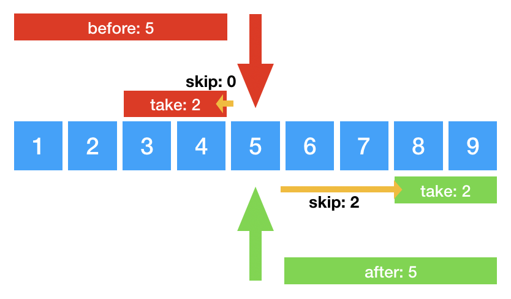

# Prisma Client JS

- Stakeholders: @sorenbs @timsuchanek @schickling
- State:
  - Spec: Unknown Documenting existing implementation. Still WIP.
  - Implementation: Mostly implemented

This spec describes the Prisma Client Javascript API

---

<!-- START doctoc generated TOC please keep comment here to allow auto update -->
<!-- DON'T EDIT THIS SECTION, INSTEAD RE-RUN doctoc TO UPDATE -->


- [Background](#background)
    - [Goals for the Prisma Client JS API](#goals-for-the-prisma-client-js-api)
- [Client Layout](#client-layout)
    - [A note on Promises](#a-note-on-promises)
- [Logging](#logging)
- [Error Formatting](#error-formatting)
  - [Environment variables](#environment-variables)
  - [Constructor args](#constructor-args)
- [Reading data](#reading-data)
    - [Default selection set](#default-selection-set)
  - [Find a single record](#find-a-single-record)
    - [where](#where)
    - [include](#include)
      - [Including a to-one relation](#including-a-to-one-relation)
      - [Including multiple relation-hops](#including-multiple-relation-hops)
      - [Include a to-many relation and use relation arguments](#include-a-to-many-relation-and-use-relation-arguments)
    - [select](#select)
  - [Find multiple records](#find-multiple-records)
    - [where](#where-1)
      - [Exact match and advanced filters](#exact-match-and-advanced-filters)
      - [Boolean combinators](#boolean-combinators)
      - [Syntax inconsistency between findOne and findMany](#syntax-inconsistency-between-findone-and-findmany)
    - [pagination: before, after, first, last, skip](#pagination-before-after-first-last-skip)
  - [Raw database access](#raw-database-access)
    - [Raw Usage](#raw-usage)
- [Writing data](#writing-data)
  - [Create a single record](#create-a-single-record)
    - [data](#data)
      - [Scalar fields](#scalar-fields)
      - [To-one relation fields](#to-one-relation-fields)
      - [To-many relation fields](#to-many-relation-fields)
    - [Include and select](#include-and-select)
  - [Delete a single record](#delete-a-single-record)
    - [where](#where-2)
    - [Include and select](#include-and-select-1)
  - [Delete multiple records](#delete-multiple-records)
    - [where](#where-3)
  - [Update a single record](#update-a-single-record)
    - [where](#where-4)
    - [data](#data-1)
      - [Scalar fields](#scalar-fields-1)
      - [To-one relation fields](#to-one-relation-fields-1)
      - [To-many relation fields](#to-many-relation-fields-1)
    - [](#)
    - [Include and select](#include-and-select-2)

<!-- END doctoc generated TOC please keep comment here to allow auto update -->

# Background

Prisma Query Engine performs efficient data retrieval from various datasources. A generated Prisma Client provides an ergonomic interface for developers working with Prisma. This spec describes the leftmost arrow in the diagram below labelled "Query".


Prisma is designed to decouple the data retrieval work done by Prisma Query engine from the interface exposed to developers through the generated Prisma Client. This enables us to optimise Prisma Client API for every language we target. It is a goal to be as language-idiomatic as possible.

### Goals for the Prisma Client JS API

- Provide an API that is intuitive for JavaScript developers
- Take advantage of TypeScript to provide the best possible typesafe API

# Client Layout

The client is generated from a Prisma Schema. When imported, it already contain any required configuration:

```typescript
import { PrismaClient } from '@prisma/client'
const prisma = new PrismaClient()
```

The client has two methods for connection handling:

```typescript
prisma.connect(): Promise<void>
prisma.disconnect(): Promise<void>
```

The only other fields present on the top-level PrismaClient object is a field for each of your models. If you have two models named `Post` and `User` in your Prisma Schema, the `prisma` object could look like this:

```typescript
{
  connect(): Promise<void>,
	disconnect(): Promise<void>,
  post: PostDelegate,
  user: UserDelegate
}
```

### A note on Promises

Any method that performs IO will return a promise. Or to be more precise, a promise-like object. They work like promises, but have extra fields and methods to enable the elegant chaining API. The TypeScript definition for such a Promise might look like this:

```typescript
declare class PostClient<T> implements Promise<T>
```

In the following we will ignore this detail, and simply write type declarations like this:

```typescript
Promise<Post>
```

# Logging

All Prisma Query engine related logs can be configured with the `log` property in the PrismaClient constructor.
These are examples how to specify different log levels:

Just providing the log levels, stdout as default.

```ts
const prismaClient = new PrismaClient({
  log: ['info', 'query'],
})
```

Changing on a per log level, where the logs end up: As an event or in stdout.

```ts
const prismaClient = new PrismaClient({
  log: [
    {
      level: 'info',
      emit: 'stdout',
    },
    {
      level: 'query',
      emit: 'event',
    },
    'warn',
  ],
})

prismaClient.on('query', e => {
  console.log(e.timestamp, e.query, e.params)
})
```

Log level names get mapped to the event name for the event emitter.

```ts
const prismaClient = new PrismaClient({
  log: [
    {
      level: 'info',
      emit: 'event',
    },
    {
      level: 'query',
      emit: 'event',
    },
    {
      level: 'warn',
      emit: 'event',
    },
  ],
})

prismaClient.on('query', e => {
  e.timestamp
  e.query
  e.params
  e.duration
  e.target
  console.log(e)
})

prismaClient.on('info', e => {
  e.timestamp
  e.message
  e.target
  console.log(e)
})

prismaClient.on('warn', e => {
  e.timestamp
  e.message
  e.target
  console.log(e)
})
```

# Error Formatting

By default, Prisma Client uses ANSI escape characters to pretty print the error stack and give recommendations on how to fix a problem facing with Prisma Client. While this is very useful when using Prisma Client from the terminal, in contexts like a GraphQL api, you only want the minimal error without any additional formatting.

This is how error formatting can be configured with Prisma Client JS.

There are 3 error formatting levels:

1. **Pretty Error**: Includes a full stack trace with colors, syntax highlighting of the code and extended error message with a possible solution for the problem. (_default_)
2. **Colorless Error**: Same as pretty errors, just without colors.
3. **Minimal Error**: Just the pure error message.

In order to configure these different error formatting levels, we have two options: Environment variables and the `PrismaClient` constructor.

## Environment variables

1. `NO_COLOR`: If this env var is provided, colors are stripped from the error message. Therefore we end up with a **colorless error**. The `NO_COLOR` environment variable is a standard described [here](https://no-color.org/). We have a tracking issue [here](https://github.com/prisma/prisma2/issues/686).
2. `NODE_ENV=production`: If the env var `NODE_ENV` is set to `production`, only the **minimal error** will be printed. This allows for easier digestion of logs in production environments.

## Constructor args

The constructor argument to control the error formatting is called `errorFormat`. It can have the following values:

- `undefined`: If it's not defined, the default is `pretty`
- `pretty`: Enables pretty error formatting
- `colorless`: Enables colorless error formatting
- `minimal`: Enables minimal error formatting

It can be used like so:

```ts
const prisma = new PrismaClient({
  errorFormat: 'minimal',
})
```

As the `errorFormat` property is optional, you still can just instantiate Prisma Client like this:

```ts
const prisma = new PrismaClient()
```

# Reading data

There are two methods related to reading records:

```
prisma.post.findOne([args]): Promise<Post>
prisma.post.findMany([args]): Promise<Post[]>
```

### Default selection set

By default, Prisma Client returns all scalar fields on a record, and no related records. This behavior can be decided on a per-query basis using the `include` and `select` fields described below.

## Find a single record

Retrieves a single record that can be unambiguously identified by a single unique field or a combination of fields that together are unique.

```typescript
prisma.post.findOne([args]): Promise<Post>
```

args is an object with a single required field `where` and two optional fields `include` and `select`.

Example:

```
const singlePost = await prisma.post.findOne({
	where: { id: "post-1" }
	include: { author: true }
})
```

### where

The `where` field is used to specify the fields to look up by. It contains another object with an optional field for each unique field combination:

```
model Post {
	id 		   Int  	@id
	email 	 String @unique
	category String
	title    String
	@@unique([category, title])
}
```

The above schema results in a `where` argument with the following type signature:

```
where: {
	id: number?
	email: string?
	category_title: { category: string, title: string }?
}
```

Only a single field may be used in a query, otherwise the call will error without performing the query.

### include

The `include` field is used to specify relations that should be retrieved together with the record. Related records will contain all scalar fields[LINK!] by default. If the related record also have relations, it is possible to include them as well. There is no limit to how deeply you can include relations. For to-many relations, you can also use the normal `findMany` arguments [LINK!] to filter, paginate etc.

#### Including a to-one relation

```
model Post {
	author User
}

model User {
	posts Post[]
}
```

The above schema results in a `include` argument that can be used as follows:

```
include: {
	author: true
}
```

#### Including multiple relation-hops

```
model Post {
	author User
}

model User {
	posts 	 Post[]
	friends: User[]
}
```

The above schema results in a `include` argument that can be used as follows:

```
include: {
	author: {
		friends: true
	}
}
```

#### Include a to-many relation and use relation arguments

```
model Post {
	comments Comment[]
}

model Comment {
	text String
}
```

The above schema results in a `include` argument that can be used as follows:

```
include: {
	comments: {
		skip: 10,
		first: 10
	}
}
```

### select

The `select` field is used to override the default selection set [LINK!]. When present, only scalar fields and relations explicitly requested are returned:

```
model Post {
  title		 String
	comments Comment[]
}

model Comment {
	text String
}
```

The above schema results in a `select` argument that can be used as follows:

```
select: {
	title: true
	comments: {
		skip: 10,
		first: 10
	}
}
```

Note that `select` and `include` cannot be combined.

## Find multiple records

Retrieves a list of records that match the filter criteria in the `where` field:

```typescript
prisma.post.findMany([args]): Promise<Post[]>
```

args is an object with 9 optional fields `where`,`before`, `after`, `first`, `last`, `skip`, `orderBy`, `select`, `include`.

Example:

```typescript
prisma.post.findMany({
  first: 10,
  where: {
    title: { contains: 'abba' },
  },
})
```

> return the first 10 posts where the title contains "abba"

`findMany` always returns a list containing 0, 1 or many records.

### where

The `where` field is used to specify the filter to apply when selecting records to return. Unlike `findOne`, the filter can use any field(s), not just unique fields. It contains an optional field for each field on the model:

```
model Post {
	id 		   Int  	@id
	email 	 String @unique
	category String
	title    String
}
```

```
where: {
	id: number | NumberFilter | null
	email: string | StringFilter | null
	category: string | StringFilter | null
	title: string | StringFilter | null
	AND: Enumerable<PostWhereInput> | null
  OR: Enumerable<PostWhereInput> | null
  NOT: Enumerable<PostWhereInput> | null
}
```

#### Exact match and advanced filters

Prisma Client support supplying an exact match filter directly, or using one of the more advanced filters:

```
export declare type StringFilter = {
    equals?: string | null;
    not?: string | StringFilter | null;
    in?: Enumerable<string> | null;
    notIn?: Enumerable<string> | null;
    lt?: string | null;
    lte?: string | null;
    gt?: string | null;
    gte?: string | null;
    contains?: string | null;
    startsWith?: string | null;
    endsWith?: string | null;
};
export declare type DateTimeFilter = {
    equals?: Date | string | null;
    not?: Date | string | DateTimeFilter | null;
    in?: Enumerable<Date | string> | null;
    notIn?: Enumerable<Date | string> | null;
    lt?: Date | string | null;
    lte?: Date | string | null;
    gt?: Date | string | null;
    gte?: Date | string | null;
};
export declare type BooleanFilter = {
    equals?: boolean | null;
    not?: boolean | BooleanFilter | null;
};
export declare type IntFilter = {
    equals?: number | null;
    not?: number | IntFilter | null;
    in?: Enumerable<number> | null;
    notIn?: Enumerable<number> | null;
    lt?: number | null;
    lte?: number | null;
    gt?: number | null;
    gte?: number | null;
};
export declare type FloatFilter = {
    equals?: number | null;
    not?: number | FloatFilter | null;
    in?: Enumerable<number> | null;
    notIn?: Enumerable<number> | null;
    lt?: number | null;
    lte?: number | null;
    gt?: number | null;
    gte?: number | null;
};
```

Exact Match examples:

```typescript
prisma.post.findMany({
  where: {
    title: 'abba is my favourite group!',
  },
})

prisma.post.findMany({
  where: {
    title: 'abba is my favourite group!',
    category: '1980 music',
  },
})
```

Advanced Filter examples:

```
prisma.post.findMany({
	where: {
		title: { startsWith: "abba" }
	}
})

prisma.post.findMany({
	where: {
		title: { not: { contains: "abba" } },
		id: { lt: 47 }
	}
})
```

#### Boolean combinators

Prisma Client supports 3 boolean combinators: `OR`, `NOT`, `AND`, that all take an array of objects with the exact same shape as the `where` argument.

Either the title or id field must match the creiterias:

```
prisma.post.findMany({
	where: {
		OR: [
			{ title: { not: { contains: "abba" } } },
			{ id: { lt: 47 }}
    ]
	}
})
```

Neither the title nor id field must match the creiterias:

```
prisma.post.findMany({
	where: {
		NOT: [
			{ title: { not: { contains: "abba" } } },
			{ id: { lt: 47 }}
    ]
	}
})
```

Both the title or id field must match the creiterias (above). This is equivalent to the simplified form not using the `AND` combinator (below):

```
prisma.post.findMany({
	where: {
		AND: [
			{ title: { not: { contains: "abba" } } },
			{ id: { lt: 47 }}
    ]
	}
})
```

```
prisma.post.findMany({
	where: {
		title: { not: { contains: "abba" } },
		id: { lt: 47 }
	}
})
```

#### Syntax inconsistency between findOne and findMany

The syntax for finding a single record that can be uniquely identified by two or more fields using the `findOne` API is different from returning that same record using the `findMany` API. This is due to the implementation complexity of supporting that same API in the `findOne` case:

```
model Post {
	category String
	title    String
	@@id([category, title])
}
```

> Note: `@@id` is not supported yet

```typescript
prisma.post.findOne({
  where: {
    category_title: {
      category: '1980 music',
      title: 'abba is my favourite group!',
    },
  },
})
```

```typescript
prisma.post.findMany({
  where: {
    category: '1980 music',
    title: 'abba is my favourite group!',
  },
})
```

### pagination: before, after, first, last, skip

Together, these five fields provide powerful pagination control.

`before` and `after` are cursors that point to a particular record, either using its `@id` field or a nuique field combination.

> Note: only `@id` is supported at the moment

`first` and `last` specify how many records to retrieve, either from the beginning or the end of the list.

`skip` pushes the beginning of the `first` or `last` segment away from the cursor specified by `before` or `after` be the amount specified. This is illustrated with yellow arrows on the illustration below.


> Note: There is an [outstanding proposal](https://github.com/prisma/specs/issues/376) to simplify the pagination model by combining the `first` and `last` fields into a single `take` field.
>
> This proposal is based on two observations: 1) `last` is only really useful in combination with `before` and `first` is only really useful in combination with `after`, as such we are using two variables to describe a single degree of freedom, which is confusing. 2) Even if other combinations are useful, they can be simply achieved by using the regular `where` filters.
>
> If adopted, this proposal will result in a simpler mental model depicted below.

Proposed simpler model:



## Raw database access

It allows you to execute raw SQL on the database.
Prisma accepts any raw SQL string and executes it directly against the database.
Prisma does not perform escaping of user input, so this should be handled by the user in order to prevent SQL injection attacks.
Numerous libraries exist for this purpose, including the popular `sqlstring` for MySQL.

### Raw Usage

```ts
const result: number = await prisma.raw('SELECT 1')

type User = {
  id: string
  name: string
  email: string
}

const users: Array<User> = await prisma.raw('SELECT * FROM User')
```

# Writing data

> This section is WIP

There are six methods related to creating, updating and deleting records:

```
photon.post.create([args]): Promise<Post>
photon.post.delete([args]): Promise<Post>
photon.post.deleteMany([args]): Promise<BatchPayload>
photon.post.update([args]): Promise<Post>
photon.post.updateMany([args]): Promise<BatchPayload>
photon.post.updsert([args]): Promise<Post>
```

## Create a single record

Creates a single record and returns the created record, including any auto-generated fields such as a id field with a default value.

```typescript
photon.post.create([args]): Promise<Post>
```

args is an object with a single required field `data` and two optional fields `include` and `select`.

Example:

```
const singlePost = await photon.post.create({
	data: { id: "post-1", title: "New Post" }
})
```

### data

The `data` field is used to provide scalar fields for the record as well as decide how to handle relations. All required fields are non-nullable.

#### Scalar fields

Scalar fields must be set to a value of matching type:

```
title: "New Post"
```

#### To-one relation fields

To-one relation fields have two options: 

`create` creates a completely new model and establishes the relation. It has the same shape as the top-level `photon.model.create` methods `data` field. 

`connect` uniquely identifies a record and establishes the relation. It has the same shape as the top-level `photon.model.findOne` methods `where` field.

`create` and `connect` are optional fields, but you will receive a runtime error if not exactly one is specified.

Example:

```
const singlePost = await photon.post.create({
	data: { id: "post-1", title: "New Post", author: { connect: { id: "author-1" }} }
})
```


#### To-many relation fields

To-many relation fields have two options `create` and `connect`. They work similarly to to-one fields, except they take either a single object or an array of objects:

```
const singleAuthor = await photon.author.create({
	data: { id: "author-1", email: "some@author.com", posts: { connect: [{ id: "post-1" }, { id: "post-2" }]} }
})
```

### Include and select

Include and select are used to specify the fields included in the created record. The behavior is identical to that of `findOne` [LINK].

## Delete a single record

Deletes a single record and returns the deleted record

```typescript
photon.post.delete([args]): Promise<Post>
```

args is an object with a single required field `where` and two optional fields `include` and `select`.

Example:

```
const deletedPost = await photon.post.delete({
	where: { id: "post-1" }
})
```

### where

The `where` field uniquely identifies the record to be deleted. It has the same shape as the `photon.model.findOne` methods `where` field.

### Include and select

Include and select are used to specify the fields included retrieved record. The behavior is identical to that of `findOne` [LINK].

The data to be returned is retrieved from the database before deleting the record. 

## Delete multiple records

Deletes multiple records and returns a count of the deleted records.

```typescript
photon.post.deleteMany([args]): Promise<BatchPayload>
```

args is an object with a single required field `where`

Example:

```
const deletedPost = await photon.post.deleteMany({
	where: { title: { contains: "car" } }
})
```

The return value has this shape:

```
{
	count: number
}
```

### where

The `where` field identifies the records to be deleted. It has the same shape as the `photon.model.findMany` methods `where` field.

## Update a single record

Updates a single record and returns the updated record

```typescript
photon.post.update([args]): Promise<Post>
```

args is an object with a two required fields `where` and `data` as well as two optional fields `include` and `select`.

Example:

```
const deletedPost = await photon.post.update({
	where: { id: "post-1" },
	data: { title: "A new title" }
})
```

### where

The `where` field uniquely identifies the record to be updated. It has the same shape as the `photon.model.findOne` methods `where` field.

The `data` field is used to provide scalar fields for the record as well as decide how to handle relations. All required fields are non-nullable.

### data

The `data` field is used to update scalar fields as well as relations. All fields are optional, but at least one must be provided.

#### Scalar fields

Scalar fields must be set to a value of matching type:

```
title: "New Post"
```

If the field is nullable, it can be set to null:

```
title: null
```

#### To-one relation fields

To-one relation fields have two options: 

`create` creates a completely new model and establishes the relation. It has the same shape as the top-level `photon.model.create` methods `data` field. 

`connect` uniquely identifies a record and establishes the relation. It has the same shape as the top-level `photon.model.findOne` methods `where` field.

`create` and `connect` are optional fields, but you will receive a runtime error if not exactly one is specified.

Example:

```
const singlePost = await photon.post.create({
	data: { id: "post-1", title: "New Post", author: { connect: { id: "author-1" }} }
})
```


#### To-many relation fields

To-many relation fields have two options `create` and `connect`. They work similarly to to-one fields, except they take either a single object or an array of objects:

```
const singleAuthor = await photon.author.create({
	data: { id: "author-1", email: "some@author.com", posts: { connect: [{ id: "post-1" }, { id: "post-2" }]} }
})
```

### 

### Include and select

Include and select are used to specify the fields included retrieved record. The behavior is identical to that of `findOne` [LINK].

The data to be returned is retrieved from the database before deleting the record. 
