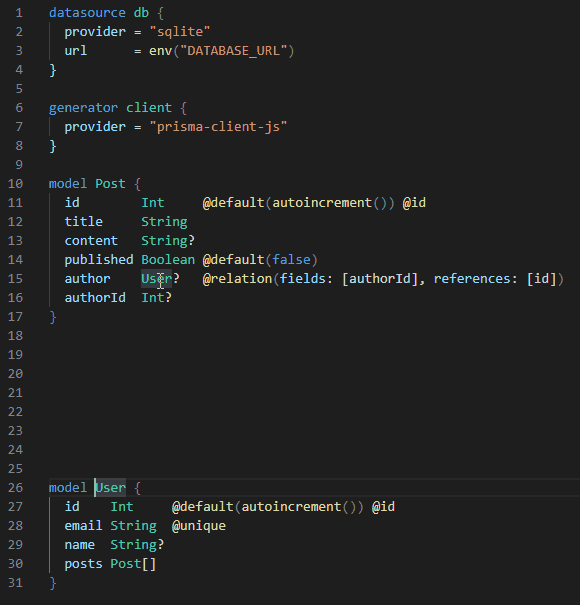

# Prisma VSCode Extension

- Stakeholders: @mattmueller @mavilein @janpio
- State:
  - Spec: In Progress 🚧
  - Implementation: Fully implemented ✅

The Prisma VSCode Extension adds [Syntax Highlighting](#syntax-highlighting), [Linting](#linting), [Formatting](#formatting) and [Go to Definition](#go-to-definition) for `.prisma` files to VSCode.  
It can be installed via [https://marketplace.visualstudio.com/items?itemName=Prisma.prisma](https://marketplace.visualstudio.com/items?itemName=Prisma.prisma).

---

<!-- START doctoc generated TOC please keep comment here to allow auto update -->
<!-- DON'T EDIT THIS SECTION, INSTEAD RE-RUN doctoc TO UPDATE -->

- [Functionality](#functionality)
  - [Syntax Highlighting](#syntax-highlighting)
  - [Linting](#linting)
  - [Formatting](#formatting)
  - [Go to Definition](#go-to-definition)
- [Technical Implementation](#technical-implementation)
  - [Installation](#installation)
  - [Syntax Highlighting](#syntax-highlighting-1)
  - [Linting](#linting-1)
  - [Formatting](#formatting-1)
  - [Go to Definition](#go-to-definition-1)

<!-- END doctoc generated TOC please keep comment here to allow auto update -->

## Functionality 

### Syntax Highlighting

Syntax highlighting runs for all `.prisma` files as soon as you open them, and keeps the syntax highlighting updated permanently as you change the file.

The following elements of a schema file are highlighted:

- Model Blocks (`model`)
- Config Blocks (`datasource` and `generator`)
- Enum Blocks (`enum`) (not supported yet)
- Double and triple comments (`//` and `///`)

### Linting

Linting runs for all `.prisma` files as soon as you open them, highlighting invalid syntax or keywords in your schema file.

### Formatting

Formatting runs for all `.prisma` files on demand (Right Click -> `Format Document`) or if configured on save of the file.

Before formatting: 

After formatting:

### Go to Definition

Go to Definition runs for all `.prisma` files on demand (Right Click on model type -> `Go to Definition`).

## Technical Implementation

### Installation

During its installation the extension downloads a zipped `prisma-fmt` binary for the user's operating system from a server and unzips it to an appropriate location the extension can access to execute it.

###  Syntax Highlighting

Uses syntax definition in `syntaxes/prisma.tmLanguage.json`.

### Linting

Uses a call to the `prisma-fmt` binary.

### Formatting

Uses a call to `prisma-fmt` binary.

### Go to Definition

Implemented as a language features using the `prisma-language-server`.
